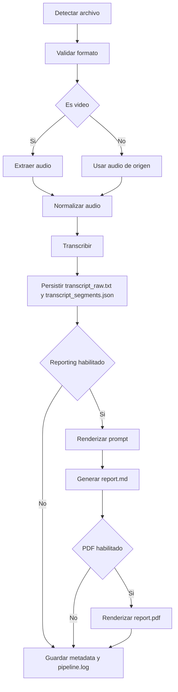

# Backlog Técnico Operativo de `media-report-cli`

## Propósito

Este documento convierte el estado real del repositorio en un backlog técnico listo para implementación. La referencia obligatoria es el baseline actual del código, y el roadmap externo de 90 días se trata como presión de negocio, no como fuente de verdad cuando entra en conflicto con el repositorio.

El backlog está organizado por épicas alineadas a `docs/context/roadmap.md` y descompuesto en sprints de dos semanas. Cada sprint define alcance cerrado, entregables verificables, riesgos y work items suficientemente específicos para arrancar implementación sin abrir decisiones de diseño.

## Supuestos Fijos

- Baseline oficial: versión `0.1.0` del repo actual.
- Arquitectura obligatoria: hexagonal con slicing moderado.
- Comando raíz estable: `media-report`.
- Comandos bootstrap que no se rompen:
  - `process`
  - `doctor`
  - `config init`
  - `config show`
  - `templates list`
- Comandos públicos actuales adicionales:
  - `transcribe`
- Nuevos comandos públicos planificados:
  - `report`
  - `clean`
- Plataformas objetivo: Linux y macOS.
- Windows: experimental, documentando regresiones sin bloquear el roadmap salvo regresión introducida de forma explícita.
- Recursos empaquetados siempre por `importlib.resources`.
- Secretos siempre redactados.
- Proveedores remotos siempre generan warning visible.
- Los artefactos intermedios se preservan por defecto para trazabilidad.

## Estado Actual vs Estado Objetivo

| Área | Estado actual confirmado | Estado objetivo del backlog | Tratamiento |
| --- | --- | --- | --- |
| CLI pública | Existen `process`, `transcribe`, `doctor`, `config`, `templates` | Mantener compatibilidad y añadir `report`, `clean` | Incremental, sin renombres |
| `process` | Descubre media, crea/reutiliza artifacts, ejecuta hasta `transcribe`, escribe `metadata.json` y `pipeline.log` | Ejecutar pipeline completo hasta Markdown/PDF con reanudación por etapas | Evolución del comando existente |
| FFmpeg | Hay port y adaptador operativos para extracción y normalización reales | Mantener la ejecución encapsulada y reutilizable por etapas | Ya cableado, extender sin romper |
| Transcripción | Existe `TranscriptionProvider`; `faster-whisper` ya transcribe y persiste transcriptos | Mantener `transcribe` estable y preparar handoff a reporting | Ya cableado, extender sin romper |
| Reporting LLM | Existen `LLMProvider`, `OllamaProvider`, `OpenAICompatibleProvider`; sin integración real | Renderizar prompt, llamar proveedor, persistir prompt/respuesta y producir `report.md` | Scaffolded, no cableado |
| PDF | Existe builder de Pandoc; plantilla TeX empaquetada | Renderizar `report.pdf` desde `report.md` preservando Markdown ante fallos | Scaffolded, no cableado |
| Configuración | Archivo TOML, env overrides, redacción de secretos, selección básica de provider/modelo y device | Configuración validada por etapa, perfiles de provider y warnings coherentes | Extender sin romper |
| Metadata | `metadata.json` v2 ya soporta etapas, transiciones y trazabilidad de transcripción | Metadata trazable completa hasta reporting/PDF sin romper compatibilidad | Extensión aditiva |
| Recursos empaquetados | Templates Markdown y TeX se cargan por paquete | Mantener el contrato para instalación por wheel, sdist y tool install | Ya bien encaminado |
| Tests | Unitarias e integraciones para scanner, planner, settings, FFmpeg, transcripción y CLI pública actual | Cobertura por etapa, smoke tests instalados y heavy tests con evidencia | Expandir |
| Release | Docs de release y packaging presentes | CI/CD, trusted publishing, TestPyPI/PyPI, smoke tests de instalación | Parcial, no automatizado |
| Portfolio/docs | README y contexto técnico presentes | Demo, guía de extensibilidad, artículo técnico y ficha de portfolio | Pendiente |

## Política de Alcance por Fase

- Fases 0 a 2 consolidan el baseline y preparan reanudación, pero no introducen aún integraciones pesadas.
- Fase 3 introduce FFmpeg sin contaminar `cli` con lógica de subprocess.
- Fase 4 cierra el contrato de transcripción y expone `transcribe` como superficie pública estable.
- Fase 5 cierra prompting y reportes LLM, y expone `report`.
- Fase 6 conecta renderizado PDF y hace que `process` sea un flujo end-to-end.
- Fase 7 endurece distribución, CI/CD y validación de instalación.
- Fase 8 se reserva para `clean`, extensibilidad y demo técnica.
- Fase 9 formaliza heavy tests y evidencia operativa con media real.
- Fase 10 cierra documentación pública, docs site y activos de portfolio técnico.

### Alineación con `docs/media-report-cli-roadmap.md`

| Fase roadmap | Estado roadmap | Sprint backlog | Gap pendiente |
| --- | --- | --- | --- |
| Fase 0 | Cumplida | Sprint 01 | Ninguno relevante |
| Fase 1 | Parcial | Sprint 09 | Evidencia consolidada de heavy tests |
| Fase 2 | Mayormente cumplida | Sprint 02 | Completar separación final de artifacts de report/PDF |
| Fase 3 | Parcial alto | Sprint 03 | Ninguno crítico; sostener compatibilidad |
| Fase 4 | Mayormente cumplida | Sprint 04 | Ninguno crítico; sostener compatibilidad |
| Fase 5 | Parcial | Sprint 05 | `report.md`, providers LLM reales y semántica final de `report` |
| Fase 6 | Pendiente | Sprint 06 | `report.pdf` y preservación de Markdown ante fallos |
| Fase 7 | Parcial | Sprint 07 | CI, smoke install, RC, TestPyPI/PyPI |
| Fase 8 | Pendiente | Sprint 08 | `clean`, guía de extensibilidad y demo técnica |
| Publicación técnica | Pendiente | Sprint 10 | docs site, caso de estudio y activos públicos |

Brechas abiertas obligatorias que este backlog debe cubrir:

- `report.md`
- `report.pdf`
- CI/TestPyPI/PyPI
- demo/portfolio
- guía de extensibilidad
- evidencia de heavy tests

## Mapa de Sprints

| Sprint | Fases | Horizonte | Objetivo principal |
| --- | --- | --- | --- |
| Sprint 01 | 0-1 | Días 0-14 | Congelar contrato público, baseline y esquema de metadata |
| Sprint 02 | 2 | Días 15-28 | Reanudación y modelo de artefactos listos para pipeline real |
| Sprint 03 | 3 | Días 29-42 | Extracción y normalización con FFmpeg |
| Sprint 04 | 4 | Días 43-56 | Pipeline de transcripción y comando `transcribe` |
| Sprint 05 | 5 | Días 57-70 | Reporting core, providers LLM y `report.md` |
| Sprint 06 | 6 | Días 71-84 | PDF, cierre end-to-end de `process` y fallos parciales preservando Markdown |
| Sprint 07 | 7 | Días 85-98 | Packaging hardening, CI/CD, release candidate y criterio go/no-go |
| Sprint 08 | 8 | Días 99-112 | `clean`, extensibilidad y demo técnica |
| Sprint 09 | 1 | Días 113-126 | Heavy tests y evidencia operativa con media real |
| Sprint 10 | 8 | Días 127-140 | Publicación técnica, docs site y activos públicos |

Los sprints 01 a 04 quedan como historial cerrado. Desde Sprint 05 en adelante el backlog ya no solo sigue `docs/context/roadmap.md`; también materializa las brechas que el roadmap público actualizado convirtió en obligaciones explícitas.

## Epic 01: Fases 0-1

### Sprint 01 - Baseline, CLI estable y esquema de metadata

- Estado: hecho
- Cerrado en: `2026-05-14T20:04:51-05:00`

- Objetivo del sprint: fijar el contrato público de `0.1.0`, cerrar vacíos de metadata y dejar una base segura para resumir etapas posteriores.
- Alcance:
  - documentar y validar el contrato actual de CLI;
  - endurecer `doctor`, `config show` y `process` como bootstrap estable;
  - versionar el esquema de metadata para estados futuros.
- Fuera de alcance:
  - ejecución real de FFmpeg;
  - transcripción real;
  - llamadas LLM o render PDF.
- Entregables:
  - contrato de CLI documentado en tests de integración;
  - esquema de metadata v2 definido y migración desde bootstrap v1;
  - fixtures mínimas para archivo único y carpeta recursiva.
- Dependencias: ninguna externa; usa solamente baseline del repo.
- Riesgos:
  - congelar demasiado pronto opciones que luego choquen con `transcribe` y `report`;
  - introducir metadata incompatible con artefactos ya generados.
- Criterio de salida:
  - tests de integración cubren ayuda, `doctor`, `config`, `templates` y `process`;
  - metadata nueva puede ser escrita y leída sin romper el bootstrap existente.

#### WI-01-01 - Congelar contrato de CLI bootstrap

- Estado: hecho
- Cerrado en: `2026-05-07T00:00:00-05:00`

- Objetivo: formalizar la superficie pública actual como contrato compatible.
- Contexto técnico: hoy la CLI se arma en `media_report.cli.app` y `process` ya expone opciones futuras como `--only-transcribe` y `--only-report`, pero aún no ejecuta etapas reales.
- Alcance funcional:
  - fijar help text y códigos de salida esperados;
  - documentar qué opciones son activas hoy y cuáles son placeholders de roadmap;
  - asegurar que nuevas opciones sean aditivas.
- No se tocará:
  - semántica de FFmpeg;
  - estructura de prompts;
  - elección final de proveedor de transcripción.
- Cambios esperados de CLI/API/artefactos/config:
  - posibles mejoras de help text;
  - documentación explícita de opciones no cableadas;
  - ningún cambio de nombres de comandos.
- Gherkin mínimo:

```gherkin
Scenario: Mostrar ayuda del comando raíz
  Given una instalación limpia del CLI
  When ejecuto "media-report --help"
  Then veo el comando raíz "media-report"
  And veo "process", "doctor", "config" y "templates"
```

- Happy path:
  - ayuda coherente;
  - opciones visibles y estables;
  - códigos de salida 0 en comandos informativos.
- Bad paths:
  - opciones inconsistentes entre README y CLI;
  - cambios accidentales de nombre o help text crítico;
  - códigos de salida no deterministas.
- Observabilidad/logging:
  - registrar en `pipeline.log` solo cuando `process` genere artefactos;
  - no emitir stack traces para errores de uso esperados.
- Pruebas unitarias/integración:
  - integración CLI para `--help` y subcommands;
  - snapshot textual liviano de help output si aporta estabilidad.
- Criterio de aceptación:
  - la ayuda pública queda cubierta por pruebas y alineada con README.

#### WI-01-02 - Evolucionar `metadata.json` para reanudación futura

- Estado: hecho
- Cerrado en: `2026-05-08T00:11:06-05:00`

- Objetivo: mover el bootstrap actual hacia un esquema que soporte estados por etapa y errores resumidos.
- Contexto técnico: `ArtifactPlanner.bootstrap_metadata()` ya escribe `schema_version`, `workflow` y `stages`, pero todas las etapas quedan solo como `planned`.
- Alcance funcional:
  - definir estados `planned`, `running`, `completed`, `failed`, `skipped`;
  - agregar timestamps por etapa;
  - reservar campos para errores resumidos sin almacenar secretos.
- No se tocará:
  - formato final de `transcript_segments.json`;
  - política de colas o ejecución paralela.
- Cambios esperados de CLI/API/artefactos/config:
  - nuevo esquema de `metadata.json`;
  - posible helper de lectura/escritura de metadata en dominio/aplicación;
  - sin cambios de flags públicos.
- Gherkin mínimo:

```gherkin
Scenario: Bootstrap de metadata para archivo nuevo
  Given un archivo de media válido
  When ejecuto "media-report process archivo.mp4"
  Then se crea "metadata.json"
  And cada etapa tiene estado inicial y campos reservados para trazabilidad
```

- Happy path:
  - metadata legible y estable;
  - artefactos futuros ya direccionados;
  - esquema versionado.
- Bad paths:
  - incompatibilidad con artefactos existentes;
  - error de serialización al crear bootstrap;
  - fuga de secretos en errores persistidos.
- Observabilidad/logging:
  - loggear creación de metadata y versión de esquema;
  - no persistir variables de entorno sensibles.
- Pruebas unitarias/integración:
  - unitarias del planner y round-trip de metadata;
  - integración `process` verificando campos nuevos.
- Criterio de aceptación:
  - `metadata.json` soporta el ciclo completo del pipeline sin rediseño posterior.

#### WI-01-03 - Endurecer fixtures y casos de baseline

- Estado: hecho
- Cerrado en: `2026-05-14T20:04:51-05:00`

- Objetivo: disponer de fixtures mínimas y reproducibles para todo el backlog.
- Contexto técnico: hoy las pruebas fabrican archivos fake locales; falta una convención para casos de carpeta recursiva y colisión de artefactos.
- Alcance funcional:
  - crear fixtures repo-local para un archivo audio/video nominal;
  - crear fixture de carpeta con subdirectorios;
  - dejar helper de smoke test reutilizable.
- No se tocará:
  - archivos multimedia pesados;
  - fixtures que requieran internet o herramientas reales.
- Cambios esperados de CLI/API/artefactos/config:
  - nuevos fixtures bajo `tests/fixtures`;
  - sin cambios de CLI.
- Gherkin mínimo:

```gherkin
Scenario: Procesar carpeta con exploración recursiva
  Given una carpeta con media en raíz y subdirectorios
  When ejecuto "media-report process carpeta --recursive"
  Then se planifican artefactos para todos los medios soportados
```

- Happy path:
  - fixtures pequeñas y portables;
  - tests rápidos;
  - base común para sprints 02-08.
- Bad paths:
  - fixtures frágiles por paths absolutos;
  - archivos demasiado grandes para CI;
  - diferencias por plataforma.
- Observabilidad/logging:
  - no aplica más allá de mensajes de prueba.
- Pruebas unitarias/integración:
  - integración `process` con archivo único, carpeta recursiva y colisión.
- Criterio de aceptación:
  - la suite puede reutilizar fixtures sin depender de generación ad hoc.

## Epic 02: Fase 2

### Sprint 02 - Reanudación y modelo de artefactos

- Estado: hecho
- Cerrado en: `2026-05-24T01:59:19-05:00`

- Objetivo del sprint: dejar listo el modelo de artefactos para ejecución real por etapas sin perder trazabilidad ni compatibilidad.
- Alcance:
  - lectura/escritura consistente de metadata;
  - decisiones de reanudación por etapa;
  - política explícita de overwrite, reuse y fallo parcial.
- Fuera de alcance:
  - integración real con proveedores externos;
  - ejecución concurrente;
  - limpieza semántica de transcripción.
- Entregables:
  - servicio de estado de pipeline;
  - decisiones de resume/reuse desde aplicación;
  - cobertura de conflictos de artefactos y reentrada.
- Dependencias: Sprint 01 completado.
- Riesgos:
  - diseñar reanudación demasiado compleja antes de tener pipeline real;
  - duplicar reglas entre dominio y CLI.
- Criterio de salida:
  - la aplicación puede decidir qué etapas ejecutar o reutilizar en función de metadata existente.

#### WI-02-01 - Introducir modelo de estado de pipeline en dominio

- Estado: hecho
- Cerrado en: `2026-05-24T01:59:19-05:00`

- Objetivo: encapsular las reglas de transición de etapas fuera del CLI.
- Contexto técnico: hoy `_select_stages()` en `ProcessMediaService` solo decide una tupla plana a partir de flags.
- Alcance funcional:
  - representar estado de etapa y transiciones válidas;
  - modelar prerequisitos entre `extract_audio`, `normalize_audio`, `transcribe`, `report` y `pdf`;
  - exponer una decisión de plan ejecutable para `process`, `transcribe`, `report` y `clean`.
- No se tocará:
  - implementación concreta de subprocess;
  - política de retries automáticos.
- Cambios esperados de CLI/API/artefactos/config:
  - ningún nuevo flag aún;
  - metadata enriquecida con resultados de transición;
  - posible módulo nuevo en `domain.artifacts`.
- Gherkin mínimo:

```gherkin
Scenario: Reanudar desde transcripción ya completada
  Given un artifact directory con "transcribe" completado
  When solicito ejecutar reporting
  Then el plan omite extracción y normalización
  And conserva los artefactos previos
```

- Happy path:
  - el dominio decide etapas sin depender de Typer;
  - reuso correcto de artefactos;
  - base común para comandos dedicados.
- Bad paths:
  - etapa posterior solicitada sin prerequisitos;
  - metadata corrupta;
  - ambigüedad entre `overwrite` y resume.
- Observabilidad/logging:
  - cada decisión de skip/reuse debe quedar en `pipeline.log`;
  - registrar motivo resumido por etapa.
- Pruebas unitarias/integración:
  - unitarias de transiciones válidas e inválidas;
  - integración de `process --only-report` usando metadata existente.
- Criterio de aceptación:
  - el plan de ejecución se deriva de metadata y reglas de dominio, no de `if` dispersos en CLI.

- Resultado implementado:
  - `PipelineStatePlanner` centraliza la selección secuencial de etapas, prerequisitos y decisiones `planned/reused/skipped`;
  - `ProcessPlanItem` expone decisiones por etapa en vez de una tupla plana de stages;
  - `pipeline.log` persiste el resumen de decisiones por etapa para runs nuevos y reanudados.

#### WI-02-02 - Política cerrada de conflictos y reutilización de artefactos

- Estado: hecho
- Cerrado en: `2026-05-24T01:59:19-05:00`

- Objetivo: distinguir claramente entre crear, reusar, sobrescribir y abortar.
- Contexto técnico: hoy `ArtifactPlanner.prepare()` solo conoce `overwrite` y trata cualquier directorio existente como conflicto.
- Alcance funcional:
  - definir cuándo `--overwrite` borra, recicla o reescribe archivos puntuales;
  - introducir validación de artifact directory incompleto;
  - preparar la entrada futura de `report` sobre directorios existentes.
- No se tocará:
  - borrado masivo de artefactos;
  - garbage collection automática.
- Cambios esperados de CLI/API/artefactos/config:
  - posible flag aditivo como `--resume`;
  - metadata de conflicto/lock liviana si resulta necesaria;
  - mensajes de error más precisos.
- Gherkin mínimo:

```gherkin
Scenario: Conflicto de artefactos sin overwrite
  Given un artifact directory ya existente
  When ejecuto "media-report process archivo.mp4"
  Then el comando falla con código de uso controlado
  And el mensaje indica cómo reusar o sobrescribir
```

- Happy path:
  - usuario entiende cómo continuar;
  - no se pisan artefactos silenciosamente;
  - `report` y `transcribe` podrán operar sobre directorios existentes.
- Bad paths:
  - directorio parcial imposible de interpretar;
  - metadata ausente con archivos presentes;
  - reuso accidental de artefactos incompatibles.
- Observabilidad/logging:
  - registrar detección de conflicto y decisión;
  - dejar trazas sin stack trace para errores previstos.
- Pruebas unitarias/integración:
  - unitarias del planner con combinaciones create/reuse/overwrite;
  - integración CLI para conflicto, resume y directorio incompleto.
- Criterio de aceptación:
  - el usuario nunca duda si el comando va a reusar o a sobrescribir artefactos.

- Resultado implementado:
  - se añadió `--resume` como flag canónico de reentrada;
  - `--overwrite` permanece solo como alias deprecado de compatibilidad y emite warning visible;
  - la reanudación falla de forma estricta ante metadata corrupta, metadata ausente con archivos presentes, artefactos incompletos o prerequisitos no satisfechos.

#### WI-02-03 - Contrato de entrada para artifact directory

- Estado: hecho
- Cerrado en: `2026-05-24T01:59:19-05:00`

- Objetivo: establecer que `report` y `clean` puedan tomar un artifact directory como input oficial.
- Contexto técnico: hoy `process` recibe path de media o directorio de media; no hay contrato aún para operar sobre artefactos existentes.
- Alcance funcional:
  - definir heurística o validador explícito de artifact root;
  - documentar archivos mínimos requeridos por comando;
  - preparar lectura de metadata desde comandos futuros.
- No se tocará:
  - migraciones complejas entre esquemas viejos;
  - soporte de bases de datos o estado externo.
- Cambios esperados de CLI/API/artefactos/config:
  - validadores reutilizables en aplicación;
  - sin comando nuevo en este sprint, pero sí contrato interno listo.
- Gherkin mínimo:

```gherkin
Scenario: Directorio de artefactos válido para etapas posteriores
  Given un directorio con metadata y transcriptos requeridos
  When una etapa posterior valida su entrada
  Then el directorio es aceptado como artifact root oficial
```

- Happy path:
  - los comandos futuros comparten el mismo contrato de entrada;
  - menos lógica duplicada.
- Bad paths:
  - directorio con nombre correcto pero sin metadata;
  - metadata con paths absolutos inválidos;
  - artefactos requeridos ausentes.
- Observabilidad/logging:
  - registrar validación y faltantes detectados.
- Pruebas unitarias/integración:
  - unitarias del validador;
  - integración indirecta vía `process --only-report` o helpers de aplicación.
- Criterio de aceptación:
  - existe una forma única y reusable de reconocer artifact directories.

- Resultado implementado:
  - `ArtifactRootValidator` valida internamente el sibling artifact root derivado desde el media source;
  - el contrato sigue siendo interno en Sprint 02: `process` no acepta artifact roots como input público;
  - el validador exige `metadata.json` v2 consistente y outputs mínimos por etapa completada;
  - el README documenta explícitamente la matriz mínima de archivos requerida para reutilizar cada etapa completada.

## Epic 03: Fase 3

### Sprint 03 - Extracción y normalización con FFmpeg

- Estado: hecho
- Cerrado en: `2026-05-26T13:38:47-05:00`

- Objetivo del sprint: ejecutar extracción y normalización reales manteniendo FFmpeg encapsulado en infraestructura.
- Alcance:
  - port de media processing;
  - adaptador FFmpeg con construcción y ejecución de comandos;
  - actualización de metadata por etapa.
- Fuera de alcance:
  - transcripción;
  - LLM;
  - PDF.
- Entregables:
  - `MediaProcessingService` operativo;
  - `audio_extracted.wav` y `audio_normalized.wav` generados;
  - errores claros cuando falta `ffmpeg`.
- Dependencias: Sprints 01-02.
- Riesgos:
  - diferencias de comportamiento entre audio y video;
  - dependencia real de binario externo en pruebas.
- Criterio de salida:
  - `process` ejecuta extracción y normalización en Linux/macOS con pruebas unitarias y al menos una integración con binario mockeado.
- Resultado implementado:
  - `MediaProcessingService` quedó formalizado con contratos explícitos para extracción y normalización;
  - `FFmpegService` ahora cubre construcción de comandos, ejecución real de subprocess y mapeo de errores tipados;
  - `process` dejó de ser planning-only y ejecuta `extract_audio` y `normalize_audio` preservando la separación entre CLI, aplicación e infraestructura;
  - `metadata.json` v2 y `pipeline.log` se actualizan durante ejecución real con transiciones `running`, `completed` y `failed`;
  - el artifact root conserva `audio_extracted.wav` y `audio_normalized.wav` cuando el flujo avanza, y preserva fallo parcial cuando normalización cae;
  - la reanudación por etapas reutiliza outputs válidos y permite continuar desde extracción completada hacia normalización;
  - la cobertura del sprint queda respaldada por unitarias y por integración CLI con adaptador mockeado.
- Tareas transversales:
  - alinear la definición de done con outputs reales `audio_extracted.wav` y `audio_normalized.wav`;
  - exigir metadata consistente por etapa con estados `running`, `completed` y `failed`;
  - asegurar error claro cuando `ffmpeg` no está disponible;
  - exigir cobertura unitaria y al menos una integración con subprocess mockeado.
- Dependencias internas:
  - reutilizar `ArtifactPlanner`, `ArtifactRootValidator`, `PipelineStatePlanner`, `JsonPipelineMetadataRepository` y `FileSystemMediaScanner`;
  - aprovechar el esquema `metadata.json` v2 ya vigente, sin introducir una v3 en este sprint.
- Riesgos técnicos concretos:
  - diferencias entre entradas audio y video al decidir cómo producir `audio_extracted.wav`;
  - falso positivo de etapa completada si existe el archivo pero no se actualiza metadata;
  - fragilidad de pruebas si se acopla la suite al binario real de `ffmpeg`;
  - necesidad de cerrar una ruta consistente para fuentes de audio sin bifurcar la semántica del pipeline.
- Decisiones cerradas para el sprint:
  - sin paralelización;
  - sin limpieza automática de artefactos;
  - sin cambios de flags públicos;
  - sin ejecución real de transcripción, LLM o PDF.
- Cambios importantes de interfaces y tipos:
  - `MediaProcessingService` deja de ser un port mínimo de una sola operación y pasa a cubrir extracción y normalización;
  - `ProcessMediaService` pasa de devolver solo un plan a ejecutar parcialmente el pipeline y persistir progreso real;
  - `PipelineMetadata` conserva la versión 2, pero sus estados pasan de bootstrap a ejecución operativa real;
  - `FFmpegService` deja de ser solo builder y pasa a ser adaptador con ejecución controlada.
- Escenarios de prueba de referencia:
  - procesar video nominal y generar ambos WAV;
  - procesar audio nominal y generar ambos WAV con una ruta consistente;
  - fallar con mensaje claro cuando `ffmpeg` no está en `PATH`;
  - fallar normalización preservando extracción y registrando `failed`;
  - reanudar una corrida donde extracción ya estaba completada;
  - rechazar metadata que marque `completed` sin outputs presentes;
  - mantener `--only-report` bloqueado en corridas nuevas;
  - mantener CLI estable sin renombrar `media-report` ni `process`.

#### WI-03-01 - Formalizar el port `MediaProcessingService`

- Estado: hecho
- Cerrado en: `2026-05-26T12:49:21-05:00`

- Objetivo: sacar el conocimiento de FFmpeg de la capa de aplicación.
- Contexto técnico: existe `FFmpegService.build_extract_command()` pero no un port estable ni una implementación completa para normalización.
- Alcance funcional:
  - definir port de dominio para extracción y normalización;
  - modelar resultados y errores;
  - agregar soporte tanto para input audio como video.
- No se tocará:
  - paralelización de FFmpeg;
  - soporte de formatos exóticos fuera de los ya clasificados por scanner.
- Cambios esperados de CLI/API/artefactos/config:
  - sin cambios públicos obligatorios;
  - nuevas clases en `domain.media.ports` o módulo equivalente;
  - artefactos `audio_extracted.wav` y `audio_normalized.wav` como outputs reales.
- Gherkin mínimo:

```gherkin
Scenario: Extraer audio desde video
  Given un archivo de video soportado
  When la aplicación ejecuta la etapa de extracción
  Then se genera "audio_extracted.wav"
  And la metadata marca "extract_audio" como completada
```

- Happy path:
  - video produce audio mono a 16 kHz;
  - audio de entrada puede pasar directo a normalización si aplica;
  - resultados persistidos en artifact dir.
- Bad paths:
  - binario `ffmpeg` ausente;
  - comando retorna código no cero;
  - output parcial o corrupto.
- Observabilidad/logging:
  - log de comando ejecutado sin secretos;
  - duración, exit code y paths de salida;
  - resumen de stderr en metadata si falla.
- Pruebas unitarias/integración:
  - unitarias de builders de comando;
  - tests de mapping de errores;
  - integración con monkeypatch/subprocess fake.
- Criterio de aceptación:
  - aplicación depende del port, no de listas de strings FFmpeg.
- Desglose de tareas:
  - Arquitectura:
    - cerrar el contrato del port `MediaProcessingService` en `domain.media.ports` para cubrir `extract_audio` y `normalize_audio`;
    - definir requests y resultados propios del dominio o de aplicación para no propagar listas de argumentos FFmpeg fuera de infraestructura;
    - definir errores de dominio/aplicación para binario ausente, ejecución fallida, output no generado y formato no soportado;
    - mantener la dependencia desde aplicación hacia el port, sin imports desde `application` a `infrastructure.ffmpeg.service`.
  - Negocio/valor:
    - documentar que este port habilita el primer avance real del pipeline y reduce el riesgo de bloqueo para Sprint 04;
    - dejar explícito que el valor de negocio del sprint es producir WAV trazables y reutilizables, no transcribir todavía.
  - Funcional:
    - definir comportamiento para fuente `video` con extracción a mono 16 kHz hacia `audio_extracted.wav`;
    - definir comportamiento para fuente `audio` con una ruta consistente que también produzca `audio_extracted.wav`;
    - definir la etapa de normalización para producir `audio_normalized.wav` a partir del artefacto extraído;
    - fijar que ambos outputs viven en el artifact root calculado por `ArtifactPlanner`;
    - precisar que el adaptador FFmpeg encapsula construcción de comando, ejecución, captura de stderr y validación de output.
  - No funcional:
    - registrar comando, duración, exit code y resumen de stderr en `pipeline.log` sin exponer secretos;
    - garantizar comportamiento equivalente en Linux y macOS, dejando Windows como experimental;
    - mantener `ffmpeg` como dependencia externa al sistema y fuera de dependencias Python pesadas;
    - asegurar errores deterministas y legibles para CLI y futura integración con `doctor`.
  - Pruebas:
    - añadir unit tests para builders de extracción y normalización;
    - añadir unit tests de mapeo de errores de subprocess a errores del proyecto;
    - añadir tests para outputs inexistentes o parciales;
    - mantener las pruebas sin invocar `ffmpeg` real, usando doubles o monkeypatch.
  - Documentación/aceptación:
    - actualizar el criterio de aceptación para exigir soporte explícito a audio y video;
    - añadir nota de diseño sobre por qué FFmpeg queda contenido en infraestructura;
    - dejar escrito que el contrato del port se cierra antes de cablear `process`.

- Resultado implementado:
  - `MediaProcessingService` quedó expandido con operaciones explícitas de `extract_audio` y `normalize_audio`;
  - `domain.media.entities` ahora modela requests y results tipados para extracción, normalización y retorno de ejecución;
  - `core.errors` incorpora errores específicos de media processing para ausencia de `ffmpeg`, exit code no cero y output faltante;
  - `FFmpegService` dejó de ser solo builder y ahora ejecuta subprocess, resume `stderr`, mide duración y valida outputs;
  - la validación de formatos soportados sigue en `FileSystemMediaScanner`, evitando duplicación en el adaptador;
  - la cobertura unitaria valida builders, mapeo de errores y casos de éxito sin depender del binario real.
  - el logging a `pipeline.log` y la actualización de metadata por etapa quedan diferidos a WI-03-02, que es donde entra la orquestación real del pipeline.

#### WI-03-02 - Cablear `process` a etapas reales de audio

- Estado: hecho
- Cerrado en: `2026-05-26T13:35:10-05:00`

- Objetivo: pasar de planificación a ejecución real en las primeras dos etapas.
- Contexto técnico: `ProcessMediaService.process()` hoy solo crea artefactos y devuelve plan.
- Alcance funcional:
  - ejecutar etapas `extract_audio` y `normalize_audio`;
  - actualizar metadata y log en tiempo real;
  - dejar preparado el handoff a transcripción.
- No se tocará:
  - report generation;
  - reintentos inteligentes;
  - ejecución paralela de múltiples archivos.
- Cambios esperados de CLI/API/artefactos/config:
  - `process` pasa de planning-only a ejecución parcial real;
  - posible salida de consola con resumen de etapas ejecutadas;
  - sin cambio de nombre de flags.
- Gherkin mínimo:

```gherkin
Scenario: Procesar archivo y detenerse antes de transcribir
  Given un archivo soportado
  When ejecuto "media-report process archivo.mp4 --only-transcribe"
  Then se ejecutan extracción y normalización
  And quedan listos los WAV para transcripción
```

- Happy path:
  - audio normalizado persistido;
  - etapas previas marcadas como completadas;
  - pipeline listo para sprint 04.
- Bad paths:
  - normalización falla y deja solo extracción;
  - metadata no refleja fallo parcial;
  - directorio existente contiene WAV incompatibles.
- Observabilidad/logging:
  - inicio/fin por etapa;
  - resumen de skip/reuse por archivo;
  - logging consistente con `pipeline.log`.
- Pruebas unitarias/integración:
  - integración `process` con stub de media processor;
  - tests de fallo parcial preservando `audio_extracted.wav`.
- Criterio de aceptación:
  - `process` deja el pipeline realmente avanzado, no solo planificado.
- Desglose de tareas:
  - Arquitectura:
    - inyectar `MediaProcessingService` en `ProcessMediaService`;
    - separar explícitamente la planificación (`stage_decisions`) de la ejecución real por etapa;
    - introducir helpers para actualizar metadata por etapa en `running`, `completed` y `failed` reutilizando el esquema v2;
    - mantener CLI como capa de entrada y salida, dejando la secuencia de ejecución en aplicación.
  - Negocio/valor:
    - dejar explícito que el objetivo del sprint es que `process` deje de ser planning-only;
    - alinear la HU con el uso principal del producto: dejar un artifact root útil para retomar con transcripción en Sprint 04.
  - Funcional:
    - ejecutar `extract_audio` cuando la decisión de etapa sea `planned`;
    - ejecutar `normalize_audio` solo cuando extracción termine correctamente o haya sido `reused`;
    - respetar decisiones `reused` y `skipped` generadas por `PipelineStatePlanner`;
    - persistir `audio_extracted.wav` y `audio_normalized.wav` en el artifact root;
    - mantener `--only-transcribe` como ejecución hasta `normalize_audio`; en este sprint el comando dedicado `transcribe` todavía no formaba parte de la superficie pública cerrada;
    - mantener `--only-report` bloqueado para corridas nuevas y funcional solo con `--resume` y prerequisitos satisfechos;
    - preservar artefactos previos si falla `normalize_audio`, sin borrar `audio_extracted.wav`.
  - No funcional:
    - actualizar metadata en tiempo real con `started_at`, `updated_at`, `finished_at`, `error` y `resumable`;
    - asegurar consistencia entre metadata y filesystem: ninguna etapa queda `completed` si falta su output;
    - emitir mensajes de CLI y `pipeline.log` coherentes con el estado real, no solo con el plan original;
    - mantener ejecución secuencial por archivo;
    - evitar stack traces en errores esperados de entorno como ausencia de `ffmpeg`.
  - Pruebas:
    - añadir unit tests de `ProcessMediaService` con stub de `MediaProcessingService`;
    - añadir tests de transición `planned -> running -> completed` y `planned -> running -> failed`;
    - añadir integración CLI donde `process` genera ambos WAV con adaptador mockeado;
    - añadir integración de fallo parcial donde extracción queda completada y normalización falla;
    - verificar reanudación cuando `extract_audio` ya está `completed` y solo debe ejecutarse `normalize_audio`.
  - Documentación/aceptación:
    - actualizar el criterio de aceptación para exigir ejecución real, no solo planificación;
    - reflejar en backlog y README que Sprint 03 deja listo el handoff hacia `transcribe`;
    - añadir nota indicando que `doctor` ya detecta `ffmpeg`, pero Sprint 03 convierte esa validación en dependencia operativa real.

- Resultado implementado:
  - `ProcessMediaService` ahora inyecta `MediaProcessingService` y ejecuta `extract_audio` y `normalize_audio` cuando las decisiones de etapa quedan `planned`;
  - la planificación y la ejecución real quedaron separadas: `stage_decisions` siguen guiando el flujo, pero `process` ya no se queda en planning-only;
  - `ArtifactPlanner` incorpora helpers puros para transiciones `running`, `completed` y `failed`, además de logging operativo en `pipeline.log`;
  - `metadata.json` v2 se actualiza en tiempo real durante bootstrap, entrada a `running`, completion y fallo parcial, sin cambiar `schema_version`;
  - los errores de media processing se mapean a `StageErrorSummary` con códigos estables para ausencia de `ffmpeg`, ejecución fallida y output faltante;
  - `process` preserva `audio_extracted.wav` cuando falla `normalize_audio` y deja el artifact root listo para reanudación;
  - la CLI ahora instancia `FFmpegService`, refleja estados finales de audio prep y deja de describir `process` como artifact planning-only;
  - README y pruebas de integración se actualizaron para reflejar que Sprint 03 ya ejecuta extracción y normalización reales;
  - la ejecución sigue detenida antes de `transcribe`, `report` y `pdf`, que permanecen como trabajo de sprints posteriores.

## Epic 04: Fase 4

### Sprint 04 - Transcripción y comando `transcribe`

- Estado: hecho
- Cerrado en: `2026-06-05T02:27:50-05:00`

- Objetivo del sprint: cerrar el pipeline de transcripción y exponer un comando público dedicado.
- Alcance:
  - provider contract para texto crudo y segmentos;
  - adaptador `faster-whisper`;
  - comando `transcribe` y reutilización desde `process`.
- Fuera de alcance:
  - limpieza semántica de transcriptos;
  - report generation;
  - diarización.
- Entregables:
  - `transcript_raw.txt` y `transcript_segments.json`;
  - `media-report transcribe`;
  - warning/documentación clara sobre dependencia opcional `transcription`.
- Dependencias: Sprint 03.
- Riesgos:
  - coste de dependencia `faster-whisper`;
  - variación de formatos de salida;
  - necesidad de fixtures reales mínimas.
- Criterio de salida:
  - existe una ruta soportada para transcribir un artefacto normalizado o un archivo fuente desde CLI.

#### WI-04-01 - Expandir `TranscriptionProvider` para salida estructurada

- Estado: hecho
- Cerrado en: `2026-05-31T01:17:39-05:00`

- Objetivo: hacer que el port devuelva suficiente información para reporting y limpieza futura.
- Contexto técnico: hoy `TranscriptionProvider.transcribe()` devuelve solo `str`.
- Alcance funcional:
  - definir entidades de segmento y resultado de transcripción;
  - persistir texto plano y JSON estructurado;
  - incluir idioma detectado cuando esté disponible.
- No se tocará:
  - diarización;
  - alineación word-level;
  - storage externo.
- Cambios esperados de CLI/API/artefactos/config:
  - `transcript_segments.json` con contrato estable;
  - posible campo de idioma en metadata;
  - sin flags nuevos obligatorios salvo `transcribe`.
- Gherkin mínimo:

```gherkin
Scenario: Transcribir audio normalizado
  Given un "audio_normalized.wav" disponible
  When la etapa de transcripción se ejecuta
  Then se guarda "transcript_raw.txt"
  And se guarda "transcript_segments.json"
```

- Happy path:
  - resultado consistente entre texto y segmentos;
  - idioma persistido;
  - base utilizable por `clean` y `report`.
- Bad paths:
  - modelo no disponible;
  - provider devuelve segmentos vacíos;
  - JSON no serializable.
- Observabilidad/logging:
  - registrar modelo usado y duración;
  - no loggear contenido completo del transcript salvo referencia a artefacto.
- Pruebas unitarias/integración:
  - unitarias de serialización de segmentos;
  - tests de adapters con provider fake;
  - integración CLI con stub de transcripción.
- Criterio de aceptación:
  - el resultado de transcripción ya no obliga a reinterpretar texto libre aguas abajo.
- Tareas técnicas del WI:
  - definir `TranscriptionRequest`, `TranscriptionSegment` y `TranscriptionResult` como contrato estable del dominio;
  - evolucionar el port `TranscriptionProvider` para recibir `audio_path`, `requested_language` y `model_override`;
  - fijar `transcript_segments.json` con raíz tipo objeto y campos `provider`, `model`, `requested_language`, `detected_language` y `segments`;
  - fijar cada segmento con `index`, `start_seconds`, `end_seconds`, `text` y `confidence` opcional;
  - mantener `transcript_raw.txt` como artefacto derivado del resultado estructurado;
  - extender `metadata.json` v2 de forma aditiva con un bloque opcional de trazabilidad de transcripción;
  - persistir en metadata el provider efectivo, modelo efectivo, idioma solicitado, idioma detectado y timestamp de finalización;
  - rechazar como transcripción válida cualquier resultado con texto pero sin segmentos útiles;
  - asegurar que un fallo de serialización o persistencia deje la etapa `transcribe` en `failed`, sin falso `completed`.
- Restricciones cerradas del WI:
  - no introducir `schema_version` v3 en este sprint;
  - no agregar diarización ni word-level alignment;
  - no duplicar el transcript completo en logs ni metadata.
- Cierre esperado del WI:
  - `clean` y `report` pueden consumir un contrato estructurado, sin reparsear texto libre;
  - la metadata previa del sprint anterior sigue siendo legible y reutilizable.
- Resultado implementado:
  - `TranscriptionProvider` dejó de depender de `str` y ahora exige `TranscriptionRequest` y `TranscriptionResult` como contrato explícito del dominio;
  - el dominio de transcripción quedó modelado con `TranscriptionSegment`, soporte de `confidence` opcional y derivación determinista de `raw_text` a partir de segmentos;
  - `transcript_segments.json` quedó formalizado con raíz tipo objeto y campos `provider`, `model`, `requested_language`, `detected_language` y `segments`;
  - `transcript_raw.txt` quedó alineado como artefacto derivado de `segments`, unido por saltos de línea;
  - `PipelineMetadata` v2 ahora soporta un bloque top-level opcional `transcription` con provider, modelo, idiomas, duración y `completed_at`, sin romper compatibilidad de lectura con metadata previa;
  - `ArtifactRootValidator` ya rechaza una etapa `transcribe` marcada como `completed` cuando `transcript_segments.json` no cumple el contrato estructurado o diverge de `transcript_raw.txt`;
  - la cobertura de pruebas valida serialización de entidades, round-trip de metadata con y sin bloque `transcription`, rechazo del formato legacy `[]` y compatibilidad de la suite existente con el nuevo contrato.

#### WI-04-02 - Implementar `FasterWhisperProvider` y feature gating

- Estado: hecho
- Cerrado en: `2026-05-31T13:11:34-05:00`

- Objetivo: soportar la primera implementación real del port de transcripción.
- Contexto técnico: `faster_whisper_provider.py` hoy solo levanta `NotImplementedError`.
- Alcance funcional:
  - cargar modelo según config;
  - mapear salida del proveedor al contrato del dominio;
  - fallar con mensaje claro si la extra opcional no está instalada.
- No se tocará:
  - otros proveedores de transcripción;
  - descarga automática de modelos fuera del flujo explícito del proveedor.
- Cambios esperados de CLI/API/artefactos/config:
  - uso efectivo de `MEDIA_REPORT_WHISPER_MODEL`;
  - mensajes de `doctor` y `transcribe` sobre dependencia opcional.
- Gherkin mínimo:

```gherkin
Scenario: Ejecutar transcribe sin extra instalada
  Given una instalación sin la extra "transcription"
  When ejecuto "media-report transcribe archivo.mp3"
  Then el comando falla con mensaje accionable
  And no imprime stack trace innecesario
```

- Happy path:
  - provider inicializa modelo configurado;
  - output persistido;
  - integración clara con config.
- Bad paths:
  - paquete opcional ausente;
  - modelo inválido;
  - error interno del provider.
- Observabilidad/logging:
  - registrar provider, modelo y duración;
  - mensaje de warning si fallback local no está disponible.
- Pruebas unitarias/integración:
  - unitarias de import lazy/failure mapping;
  - integración con monkeypatch simulando proveedor instalado/no instalado.
- Criterio de aceptación:
  - `faster-whisper` queda enchufado sin meter lógica del modelo en CLI.
- Tareas técnicas del WI:
  - implementar el adaptador `FasterWhisperProvider` con import lazy de la dependencia opcional;
  - resolver el modelo efectivo a partir de `MEDIA_REPORT_WHISPER_MODEL`, con override explícito por invocación;
  - mapear la salida del proveedor real al contrato `TranscriptionResult` sin filtrar tipos propios del SDK hacia dominio o aplicación;
  - encapsular en infraestructura la normalización de idioma detectado, tiempos y `confidence`;
  - introducir errores tipados para dependencia opcional ausente, modelo inválido, ejecución fallida y salida inconsistente;
  - producir mensajes accionables desde CLI y `doctor`, evitando stack trace innecesario;
  - registrar provider, modelo y duración en `pipeline.log`, sin loggear contenido del transcript;
  - actualizar `doctor` para reportar si la capacidad de transcripción está disponible y cómo habilitarla.
- Restricciones cerradas del WI:
  - solo `faster-whisper` entra en Sprint 04 como provider real;
  - no descargar modelos automáticamente desde la CLI;
  - no validar modelos concretos en `doctor`, solo disponibilidad de la feature opcional.
- Cierre esperado del WI:
  - el port queda realmente implementado y seleccionable;
  - la ausencia de la extra `transcription` falla de forma clara, estable y documentada.
- Resultado implementado:
  - `FasterWhisperProvider` dejó de ser un stub y ahora instancia `WhisperModel` con import lazy de `faster_whisper`, resolviendo el modelo efectivo con precedencia de `model_override` sobre `MEDIA_REPORT_WHISPER_MODEL`;
  - la salida del SDK queda encapsulada en infraestructura y mapeada a `TranscriptionResult` y `TranscriptionSegment`, con normalización explícita de idioma detectado, tiempos y `confidence` opcional;
  - se introdujeron errores tipados para dependencia opcional ausente, inicialización de modelo inválida, fallo de ejecución y salida inconsistente, todos con mensajes accionables y sin stack trace innecesario hacia CLI;
  - se agregó un capability probe reutilizable para transcripción que detecta si la extra opcional está disponible y expone el hint de instalación sin descargar modelos ni validar catálogos concretos;
  - `media-report doctor` ahora reporta la capacidad de transcripción en una fila dedicada, distinguiendo disponibilidad real de la extra y preservando el hint de instalación en la salida renderizada;
  - README quedó actualizado con la instalación de la extra `transcription` y con la expectativa de observabilidad desde `doctor`;
  - la cobertura de pruebas valida import lazy, precedence de modelo, mapeo del provider, errores tipados y los dos estados visibles de `doctor` con y sin capacidad de transcripción disponible;
  - la mensajería pública del futuro comando `transcribe` quedó preparada por los errores tipados y el feature probe, mientras que el comando dedicado sigue reservado para WI-04-03.

#### WI-04-03 - Exponer `media-report transcribe`

- Estado: hecho
- Cerrado en: `2026-06-05T02:27:50-05:00`

- Objetivo: ofrecer un comando público estable para etapa de transcripción.
- Contexto técnico: hoy `process --only-transcribe` es un placeholder; falta una unidad pública más precisa.
- Alcance funcional:
  - aceptar archivo de media o artifact directory;
  - reusar extracción/normalización si faltan;
  - permitir `--language`, `--model` y `--overwrite` de forma aditiva.
  - preferir ejecución acelerada por GPU para transcripción cuando el runtime disponible lo soporte, con fallback explícito a CPU.
- No se tocará:
  - generación de reportes;
  - limpieza de texto;
  - ejecución batch en background.
- Cambios esperados de CLI/API/artefactos/config:
  - nuevo comando `transcribe`;
  - `process --only-transcribe` reutiliza el mismo caso de uso;
  - README y help text actualizados.
- Gherkin mínimo:

```gherkin
Scenario: Transcribir archivo fuente desde comando dedicado
  Given un archivo de media válido
  When ejecuto "media-report transcribe archivo.mp3 --language es"
  Then se crean o reutilizan los artefactos previos necesarios
  And la transcripción termina en el artifact directory del archivo
```

- Happy path:
  - el comando sirve tanto para primera ejecución como para resume;
  - salida clara por archivo.
- Bad paths:
  - artifact directory inválido;
  - prerequisitos ausentes;
  - `--only-transcribe` diverge semánticamente de `transcribe`.
- Observabilidad/logging:
  - registrar fuente de entrada y artifact root;
  - etapas ejecutadas vs reutilizadas.
  - registrar si la transcripción corrió con GPU o CPU y si hubo fallback.
- Pruebas unitarias/integración:
  - integración de CLI para archivo único y artifact directory;
  - tests de compatibilidad con `process --only-transcribe`.
- Criterio de aceptación:
  - `transcribe` es el contrato público recomendado para esta etapa y `process` queda como orquestador amplio.
- Tareas técnicas del WI:
  - crear un caso de uso compartido de aplicación para transcripción y reutilizarlo desde `transcribe`, `process` y `process --only-transcribe`;
  - aceptar como entrada pública un único archivo fuente o un único artifact directory por invocación;
  - si la entrada es media file, crear o reutilizar el sibling artifact root y reconstruir `extract_audio` y `normalize_audio` si faltan;
  - si la entrada es artifact directory, validar metadata, resolver el source original y reparar prerequisitos cuando todavía sea posible;
  - reutilizar por defecto una transcripción completada y válida;
  - agregar `--overwrite` en `transcribe` con semántica acotada a reejecutar la etapa `transcribe`, sin overwrite destructivo global;
  - mantener `process --overwrite` como alias deprecado de `--resume`;
  - hacer que `media-report process PATH` ejecute por defecto hasta `transcribe`, dejando `report` y `pdf` planificados;
  - hacer que `process --only-transcribe` ejecute transcripción real y comparta lógica funcional con el comando dedicado;
  - seleccionar dispositivo de ejecución con preferencia por GPU cuando el provider o runtime lo permita, sin meter heurística de hardware en la CLI;
  - persistir en metadata y `pipeline.log` el dispositivo efectivo o el motivo del fallback a CPU;
  - actualizar help text y README con instalación de la extra `[transcription]`, ejemplos de `transcribe` y diferencias con `process`.
- Restricciones cerradas del WI:
  - sin batch ni `--recursive` en `transcribe` durante Sprint 04;
  - sin generación de reportes ni limpieza semántica;
  - sin divergencia funcional entre `transcribe` y `process --only-transcribe`.
  - sin requerir GPU dedicada para que la etapa sea considerada soportada.
- Cierre esperado del WI:
  - `transcribe` opera tanto sobre fuente nueva como sobre artifact root reusable;
  - `process` sigue siendo el orquestador amplio, pero ya no se detiene antes de transcripción.

- Resultado implementado:
  - la CLI pública ahora expone `media-report transcribe` con soporte para `PATH`, `--language`, `--model` y `--overwrite`, manteniendo el comando como unidad estable y aditiva del bootstrap;
  - `TranscribeService` quedó consolidado como caso de uso compartido de aplicación y es reutilizado tanto por `transcribe` como por `process`, eliminando la divergencia funcional con `process --only-transcribe`;
  - el flujo acepta tanto media files nuevos como artifact roots reutilizables, valida `metadata.json`, resuelve el source original y repara `extract_audio` y `normalize_audio` cuando todavía es posible hacerlo;
  - la reutilización por defecto de una transcripción completada y válida quedó soportada para archivo fuente y para artifact root, mientras que `transcribe --overwrite` fuerza únicamente la etapa `transcribe` sin introducir overwrite destructivo global;
  - `media-report process PATH` ahora ejecuta por defecto `extract_audio`, `normalize_audio` y `transcribe`, dejando `report` y `pdf` como etapas `planned`, y `process --only-transcribe` comparte exactamente la misma lógica funcional del comando dedicado;
  - la preferencia de dispositivo quedó cableada desde configuración con `MEDIA_REPORT_WHISPER_DEVICE`, priorizando GPU cuando el runtime lo permite y persistiendo en metadata y `pipeline.log` el dispositivo efectivo y el motivo de fallback a CPU cuando ocurre;
  - `transcript_raw.txt` y `transcript_segments.json` se persisten como artefactos reales de transcripción mediante un repositorio dedicado de filesystem, manteniendo `metadata.json` en versión 2 con evolución aditiva;
  - README, help text y la cobertura de pruebas quedaron alineados con la nueva superficie pública, incluyendo casos de archivo fuente, artifact root, `--overwrite`, dependencia opcional ausente y compatibilidad entre `transcribe` y `process --only-transcribe`.

- Resultado esperado:
  - el pipeline ejecuta `transcribe` de forma real y persistente;
  - `process` avanza por defecto hasta `transcribe`;
  - existe un comando público dedicado y reutilizable para esta etapa.
- Tareas transversales:
  - mantener `metadata.json` en versión 2 con evolución aditiva;
  - preservar la separación hexagonal entre CLI, aplicación, dominio e infraestructura;
  - asegurar mensajes de error accionables y sin exposición de secretos;
  - alinear README, help text y `doctor` con la nueva superficie pública;
  - mantener la suite con dependencias pesadas mockeadas.
- Dependencias internas:
  - reutilizar `ArtifactPlanner`, `ArtifactRootValidator`, `PipelineStatePlanner`, `JsonPipelineMetadataRepository` y `FileSystemMediaScanner`;
  - aprovechar la semántica ya existente de artifact root y reanudación por etapas;
  - usar `MEDIA_REPORT_WHISPER_MODEL` como default de configuración sin romper el contrato actual de settings.
- Riesgos técnicos concretos:
  - inconsistencia entre `transcript_raw.txt` y `transcript_segments.json` si se persisten por caminos distintos;
  - regresión de compatibilidad si se rompe la lectura de metadata v2 previa;
  - deriva semántica entre `transcribe` y `process --only-transcribe` si no comparten el mismo caso de uso;
  - falso positivo de `completed` cuando existan archivos parciales o un provider devuelva segmentos vacíos;
  - fragilidad de pruebas si la suite se acopla al SDK real o a modelos descargados.
  - detección frágil del dispositivo si la preferencia por GPU queda mezclada con detalles del SDK.
- Decisiones cerradas para el sprint:
  - provider único del sprint: `faster-whisper`;
  - formato temporal estable: segundos `float`;
  - `confidence` opcional por segmento;
  - conservar `requested_language` y `detected_language`;
  - reutilizar por defecto una transcripción válida y usar `--overwrite` solo para forzar esa etapa;
  - `transcribe` acepta media file o artifact directory, pero no batch;
  - `process` por defecto ejecuta hasta `transcribe`.
  - cuando el runtime lo permita, `transcribe` y `process` preferirán GPU antes que CPU para inferencia local.
- Cambios importantes de interfaces y tipos:
  - `TranscriptionProvider` deja de devolver `str` y pasa a devolver un resultado estructurado;
  - `PipelineMetadata` conserva versión 2, pero suma trazabilidad opcional específica de transcripción;
  - aparece un caso de uso compartido de transcripción reutilizable desde más de un comando;
  - la CLI pública suma `media-report transcribe` y extiende la semántica efectiva de `process`.
- Escenarios de prueba de referencia:
  - transcribir un `audio_normalized.wav` nominal y persistir texto más segmentos;
  - transcribir un archivo fuente creando el artifact root cuando aún no existe;
  - reusar una transcripción completada y válida sin reejecutar el provider;
  - forzar `transcribe --overwrite` y refrescar solo los artefactos de transcripción;
  - reparar un artifact root donde falta `audio_normalized.wav` pero el source original aún existe;
  - fallar con mensaje claro cuando falta la extra `transcription`;
  - fallar cuando el provider devuelve texto sin segmentos útiles;
  - validar compatibilidad funcional entre `transcribe` y `process --only-transcribe`;
  - verificar que `process` por defecto deja `report` y `pdf` planificados tras completar `transcribe`.

## Epic 05: Fase 5

### Sprint 05 - Reporting core y `report.md`

- Estado: parcial
- Objetivo del sprint: convertir transcriptos válidos en `report.md` trazable, con prompt persistido, provider LLM operativo y una superficie pública `report` coherente con `process --only-report`.
- Alcance:
  - render de prompt desde recursos empaquetados;
  - providers `ollama` y `openai-compatible`;
  - persistencia de `prompt_used.md`, `llm_response_raw.txt` y `report.md`;
  - caso de uso compartido para `report` y `process --only-report`.
- Fuera de alcance:
  - render PDF;
  - `clean`;
  - múltiples providers LLM adicionales;
  - streaming y retries sofisticados.
- Entregables:
  - `prompt_used.md` como evidencia obligatoria;
  - `llm_response_raw.txt` y `report.md` como artifacts reales;
  - comando público `media-report report`;
  - warning remoto y redacción de secretos.
- Dependencias: Sprint 04.
- Riesgos:
  - respuestas LLM vacías o no útiles;
  - divergencia funcional entre `report` y `process --only-report`;
  - metadata inconsistente de la etapa `report`;
  - fugas de secretos en errores o logs.
- Criterio de salida:
  - un artifact root con transcripción válida puede producir `report.md` desde CLI sin reejecutar etapas upstream.

#### WI-05-01 - Servicio de render de prompt y contexto de reporte

- Estado: hecho
- Cerrado en: `2026-06-05T15:04:04-05:00`
- Objetivo: convertir artefactos de transcripción en prompts deterministas y auditables.
- Contexto técnico: las templates viven en `src/media_report/templates/prompts` y ya existe `media_report.application.reporting` para preparación y ejecución del render.
- Alcance:
  - contexto mínimo de reporte;
  - persistencia de `prompt_used.md`;
  - soporte de templates empaquetadas.
- No se tocará:
  - editor visual de prompts;
  - templates remotas;
  - llamadas HTTP a providers.
- Cambios esperados:
  - `prompt_used.md` se vuelve artifact obligatorio de reporting;
  - `workflow.template_name` queda alineado con el render efectivo;
  - sin cambio de `schema_version`.
- Gherkin:

```gherkin
Scenario: Generar prompt auditable desde artifact root
  Given un artifact directory con transcripción válida
  When renderizo el prompt con una template empaquetada
  Then se persiste "prompt_used.md"
  And el prompt incorpora contexto, template y transcripto
```

- Pruebas:
  - unitarias de render determinista y carga de templates;
  - casos de template inexistente y transcripto vacío;
  - validación de `transcript_segments.json` inconsistente.
- Checklist:
  - [x] El render usa `importlib.resources`.
  - [x] `prompt_used.md` se persiste.
  - [x] La etapa falla de forma explícita si el transcripto no es utilizable.
  - [x] No se imprime el prompt completo en consola.
- Preguntas de cierre:
  - [x] ¿La template efectiva queda trazada en metadata y log?
  - [x] ¿El render sigue siendo reutilizable desde un caso de uso de reporting?

- Resultado implementado:
  - `PromptRunPreparer` y `PromptRunExecutor` validan artifact roots reutilizables, construyen el contexto y persisten `prompt_used.md`;
  - la carga de templates sigue encapsulada detrás de `PromptTemplateRepository`;
  - la metadata mantiene trazabilidad aditiva sin marcar aún `report` como `completed`.

#### WI-05-02 - Implementar providers LLM reales y redacción de secretos

- Estado: hecho
- Cerrado en: `2026-06-12T22:14:56-05:00`
- Objetivo: soportar generación Markdown con un provider local y uno remoto compatible OpenAI sin violar la política de secretos.
- Contexto técnico: `OllamaProvider` y `OpenAICompatibleProvider` existen, pero siguen scaffolded.
- Alcance:
  - llamadas HTTP encapsuladas en infraestructura;
  - selección explícita por config o override;
  - persistencia de `llm_response_raw.txt`;
  - warning visible cuando el provider efectivo no sea local.
- No se tocará:
  - streaming público;
  - retries sofisticados;
  - otros backends remotos.
- Cambios esperados:
  - uso real de `MEDIA_REPORT_OPENAI_API_KEY`, `MEDIA_REPORT_OPENAI_BASE_URL` y `MEDIA_REPORT_OLLAMA_BASE_URL`;
  - `doctor` distingue provider local disponible, remoto incompleto o config inválida;
  - errores redactados sin API keys, bearer tokens ni headers sensibles.
- Gherkin:

```gherkin
Scenario: Generar respuesta con Ollama local
  Given un prompt persistido y proveedor "ollama"
  When ejecuto la generación LLM
  Then se persiste "llm_response_raw.txt"
  And la metadata registra provider y modelo efectivos

Scenario: Fallar con provider remoto sin API key
  Given una configuración "openai-compatible" sin API key
  When ejecuto reporting
  Then el comando falla con mensaje accionable
  And la salida no contiene secretos
```

- Pruebas:
  - unitarias de adapters LLM sobre `pydantic-ai` sin red real;
  - errores 4xx/5xx, timeout, payload vacío o inválido;
  - tests de redacción de secretos;
  - integración de reporting con providers fake local y remoto, más `doctor` con capability LLM.
- Checklist:
  - [x] `OllamaProvider` deja de lanzar `NotImplementedError`.
  - [x] `OpenAICompatibleProvider` deja de lanzar `NotImplementedError`.
  - [x] `llm_response_raw.txt` se persiste en respuestas exitosas o parcialmente útiles.
  - [x] El provider remoto muestra warning y nunca filtra secretos.
  - [x] `doctor` refleja configuración LLM incompleta o disponible.
- Preguntas de cierre:
  - [x] ¿El contracto del port sigue libre de detalles HTTP?
  - [x] ¿La redacción cubre config, consola, logs y errores?
  - [x] ¿La suite evita red real?

- Resultado implementado:
  - `ReportGenerationService` quedó incorporado como caso de uso de aplicación para cerrar la etapa `report` sobre artifact roots ya transcritos, reutilizando `PromptRenderService` y persistiendo `llm_response_raw.txt` junto con `report.md`;
  - `OllamaProvider` y `OpenAICompatibleProvider` dejaron de ser scaffolds y ahora ejecutan generación real detrás del port `LLMProvider`, manteniendo el dominio y la aplicación libres de detalles HTTP y de `pydantic-ai`;
  - la resolución del provider efectivo quedó centralizada en infraestructura a partir de `AppSettings`, incluyendo normalización de `MEDIA_REPORT_OLLAMA_BASE_URL`, validación de `MEDIA_REPORT_OPENAI_API_KEY` y selección explícita de provider/modelo sin depender de variables implícitas del runtime;
  - la redacción de secretos se consolidó en un helper reusable de core y ahora cubre `config show`, errores de providers, mensajes con bearer tokens, logs y URLs con credenciales embebidas;
  - `doctor` ahora expone una capability LLM dedicada, diferenciando provider local listo, provider remoto configurado, configuración inválida y dependencia ausente sin realizar red real;
  - la metadata de workflow y `pipeline.log` preservan trazabilidad de provider/modelo efectivos, éxito o fallo resumido y estado final de la etapa `report`, sin cambiar `schema_version`;
  - la cobertura se amplió con pruebas unitarias de providers, capabilities, redacción y generación de reportes, además de integración de reporting y `doctor`, manteniendo toda la suite libre de red real.

#### WI-05-03 - Exponer `media-report report`

- Estado: hecho
- Cerrado en: 2026-06-12T23:59:59-05:00
- Objetivo: dar una entrada pública para generar o regenerar reportes desde un artifact directory sin rehacer transcripción.
- Contexto técnico: `process --only-report` ya existe como selector de planning, pero aún no comparte un caso de uso real con una CLI dedicada.
- Alcance:
  - aceptar artifact directory como input principal y media file como alias al artifact root hermano;
  - soportar `--template`, `--provider`, `--model`, `--overwrite`;
  - reutilizar el mismo caso de uso desde `process --only-report`.
- No se tocará:
  - render PDF;
  - limpieza semántica;
  - batch reporting.
- Cambios esperados:
  - nuevo comando público `report`;
  - `process --only-report --resume` usa la misma lógica;
  - metadata y `pipeline.log` reflejan el ciclo real de `report`.
- Gherkin:

```gherkin
Scenario: Regenerar reporte desde artifact root existente
  Given un artifact directory con transcripción completada
  When ejecuto "media-report report artefactos --template technical_report"
  Then se genera "report.md"
  And no se reejecuta transcripción

Scenario: Rechazar artifact root sin prerequisitos
  Given un artifact directory sin "transcript_segments.json"
  When ejecuto "media-report report artefactos"
  Then el comando falla antes de llamar al LLM
```

- Pruebas:
  - unit tests de resolución de input para `report`, delegación compartida desde `process` y visibilidad de estados `report`/`pdf` en la presentación Rich;
  - integración CLI nominal e inválida para artifact root, media-file alias, warnings remotos y prerequisitos faltantes;
  - compatibilidad con `process --only-report --resume` y `--overwrite` limitado a artifacts de report.
- Checklist:
  - [x] Existe un comando público `media-report report`.
  - [x] El input principal es artifact directory válido.
  - [x] `process --only-report` reutiliza el mismo caso de uso.
  - [x] `report.md` se persiste y la etapa se actualiza en metadata.
- Preguntas de cierre:
  - [x] ¿`report` puede reutilizar artifacts previos de forma segura?
  - [x] ¿Los prerequisitos fallan antes de tocar el provider?
  - [x] ¿El warning remoto también aparece desde `process --only-report`?

- Resultado implementado:
  - la CLI pública ahora expone `media-report report PATH`, aceptando tanto artifact roots reutilizables como media files que se resuelven al directorio `<stem>_media_report`, sin filtrar esa heurística hacia el port de dominio;
  - `ProcessMediaService` dejó de usar `--only-report` como simple planning y ahora delega al mismo `ReportGenerationService` que usa el comando dedicado, preservando una única semántica de metadata, logging, provider efectivo y persistencia de `report.md`;
  - `GenerateReportRequest` ahora transporta explícitamente las etapas de workflow seleccionadas, de modo que `report` y `process --only-report` conservan `pdf` como etapa cola planificada mientras ejecutan de forma real la etapa `report`;
  - la presentación Rich se generalizó de forma mínima para mostrar estados `report` y `pdf` cuando el flujo lo requiere, sin duplicar tablas ni introducir una capa adicional de view models;
  - `process --only-report --overwrite` fuerza solo la regeneración de `prompt_used.md`, `llm_response_raw.txt` y `report.md`, dejando intactos los artifacts upstream de transcripción;
  - la cobertura quedó ampliada con pruebas unitarias de resolución de input, delegación compartida y renderizado de estados, además de integraciones CLI para `report`, warnings remotos y ejecución real de reporting desde `process --only-report`.

#### WI-05-04 - Cerrar semántica de completion de `report`

- Estado: nuevo
- Objetivo: fijar cuándo la etapa `report` puede considerarse `completed` y qué artifacts son obligatorios para reuso seguro.
- Contexto técnico: hoy ya existe render de prompt, pero falta cerrar la semántica final de completion y reutilización de reporting.
- Alcance:
  - definir que `report` solo queda `completed` si existen `prompt_used.md`, `llm_response_raw.txt` y `report.md` coherentes;
  - endurecer `ArtifactRootValidator` para la etapa `report`;
  - fijar semántica de reuse y `--overwrite` limitada a reporting;
  - alinear `process --only-report` con esa semántica.
- No se tocará:
  - PDF;
  - `clean`;
  - cambios de versión de metadata.
- Cambios esperados:
  - contrato explícito de artifacts obligatorios de `report`;
  - mejor validación de reuso;
  - mensajes de error más accionables ante reporting incompleto.
- Gherkin:

```gherkin
Scenario: Reusar report completado y válido
  Given un artifact root con artifacts completos de reporting
  When ejecuto reporting sin "--overwrite"
  Then la etapa "report" se reutiliza
  And no se llama al provider LLM

Scenario: Invalidar reporting incompleto
  Given un artifact root con "report.md" pero sin "llm_response_raw.txt"
  When intento reutilizar reporting
  Then la etapa no se considera completada
  And el comando propone reejecutar reporting
```

- Pruebas:
  - unitarias del validador;
  - integración de reuse completo e incompleto;
  - casos de `--overwrite` sobre artifacts parciales.
- Checklist:
  - [ ] Los tres artifacts obligatorios quedan definidos.
  - [ ] La etapa `report` no se reutiliza si falta alguno.
  - [ ] `process --only-report` y `report` comparten la misma semántica.
- Preguntas de cierre:
  - [ ] ¿La metadata no marca falsos `completed`?
  - [ ] ¿El usuario entiende cuándo reusa y cuándo regenera?

## Epic 06: Fase 6

### Sprint 06 - PDF y `process` end-to-end

- Estado: planificado
- Objetivo del sprint: completar el pipeline hasta `report.pdf` y consolidar `process` como workflow principal extremo a extremo.
- Alcance:
  - `DocumentRenderer` real con Pandoc y template empaquetada;
  - persistencia de `report.pdf`;
  - orquestación completa de `process`;
  - preservación de `report.md` y metadata coherente ante fallos parciales de PDF.
- Fuera de alcance:
  - QA visual profunda de PDF;
  - múltiples themes o engines configurables;
  - optimizaciones de rendimiento.
- Entregables:
  - etapa `pdf` operativa;
  - `process` produce `report.md` y `report.pdf` cuando el entorno lo permite;
  - manejo claro de fallo parcial conservando Markdown.
- Dependencias: Sprint 05.
- Riesgos:
  - `pandoc` o engine TeX ausentes;
  - diferencias tipográficas entre plataformas;
  - pipeline más largo y frágil si la orquestación no queda limpia.
- Criterio de salida:
  - `process` produce `report.pdf` o deja trazabilidad clara de por qué falló sin destruir `report.md`.

#### WI-06-01 - Implementar `DocumentRenderer` y adapter de Pandoc

- Estado: planificado
- Objetivo: renderizar PDF desde Markdown usando resources empaquetados.
- Contexto técnico: `PandocService.build_command()` ya existe, pero aún no ejecuta ni resuelve template desde package resources.
- Alcance:
  - cargar `default.tex` con `importlib.resources`;
  - ejecutar `pandoc` con engine soportado;
  - persistir `report.pdf`.
- No se tocará:
  - themes múltiples;
  - edición avanzada de LaTeX;
  - importación PDF como input.
- Cambios esperados:
  - `DocumentRenderer` operativo;
  - `doctor` puede endurecer validación de `pandoc` y engines TeX.
- Gherkin:

```gherkin
Scenario: Renderizar PDF desde report.md
  Given un "report.md" válido
  When ejecuto la etapa PDF
  Then se genera "report.pdf"
  And la metadata marca "pdf" como completada
```

- Pruebas:
  - unitarias del adapter y resolución de resources;
  - integración con subprocess fake;
  - smoke test instalado cuando el entorno tenga dependencias.
- Checklist:
  - [ ] La template se resuelve desde package resources.
  - [ ] `report.pdf` se persiste.
  - [ ] Los errores de `pandoc` o TeX se mapean a errores tipados.
- Preguntas de cierre:
  - [ ] ¿El render funciona igual desde wheel instalada?
  - [ ] ¿Los fallos incluyen stderr resumido útil?

#### WI-06-02 - Cerrar la orquestación completa de `process`

- Estado: planificado
- Objetivo: convertir `process` en la ruta principal end-to-end reutilizando los mismos casos de uso de `transcribe`, `report` y `pdf`.
- Contexto técnico: `process` hoy llega hasta transcripción y deja `report`/`pdf` solo planificados.
- Alcance:
  - ejecutar audio, transcripción, reporting y PDF según decisions;
  - respetar `--only-transcribe` y `--only-report`;
  - mantener compatibilidad total del comando público.
- No se tocará:
  - daemonización;
  - colas de trabajo;
  - TUI.
- Cambios esperados:
  - `process` deja de ser “transcription-ready” y pasa a ser pipeline principal completo;
  - resumen de consola más orientado a estado por etapa.
- Gherkin:

```gherkin
Scenario: Ejecutar pipeline completo
  Given un archivo de media válido y dependencias disponibles
  When ejecuto "media-report process archivo.mp4"
  Then se generan transcriptos, "report.md" y "report.pdf"
  And cada etapa queda trazada en metadata y pipeline.log
```

- Pruebas:
  - integración CLI con doubles de todas las etapas;
  - casos de fallo parcial en reporting y PDF;
  - compatibilidad con resume por etapa.
- Checklist:
  - [ ] `process` reutiliza los casos de uso de `transcribe`, `report` y `pdf`.
  - [ ] El resumen por etapa distingue `planned`, `reused`, `completed` y `failed`.
  - [ ] La compatibilidad de flags existentes se preserva.
- Preguntas de cierre:
  - [ ] ¿`process` sigue siendo el contrato principal sin duplicar lógica?
  - [ ] ¿La reanudación conserva consistencia entre metadata y filesystem?

#### WI-06-03 - Preservar `report.md` y metadata coherente ante fallos parciales de PDF

- Estado: nuevo
- Objetivo: asegurar que un fallo de PDF nunca degrade la etapa de reporting ni destruya el artifact Markdown.
- Contexto técnico: el roadmap actualizado exige que la trazabilidad se preserve incluso cuando la etapa final falle.
- Alcance:
  - marcar `pdf` como `failed` sin alterar `report` completado;
  - preservar `report.md`, `prompt_used.md` y `llm_response_raw.txt`;
  - registrar error resumido y prerequisitos satisfechos.
- No se tocará:
  - retries automáticos de PDF;
  - recuperación automática del entorno TeX.
- Cambios esperados:
  - semántica clara de fallo parcial;
  - mejor observabilidad de `pdf`.
- Gherkin:

```gherkin
Scenario: Fallar PDF preservando Markdown
  Given un artifact root con "report.md" válido
  And "pandoc" o el engine TeX fallan
  When ejecuto la etapa PDF
  Then "report.md" permanece intacto
  And la etapa "report" sigue completada
  And la etapa "pdf" queda en estado "failed"
```

- Pruebas:
  - integración de fallo parcial preservando artifacts;
  - validación de metadata y `pipeline.log`.
- Checklist:
  - [ ] El fallo de `pdf` no degrada `report`.
  - [ ] `report.md` permanece reutilizable.
  - [ ] El error resumido queda persistido.
- Preguntas de cierre:
  - [ ] ¿La reanudación desde `pdf` fallido es clara y segura?

## Epic 07: Fase 7

### Sprint 07 - Packaging hardening, CI/CD y release candidate

- Estado: planificado
- Objetivo del sprint: tratar distribución e instalación como artifacts de primera clase y cerrar un criterio técnico de salida para `v0.1.0`.
- Alcance:
  - CI de calidad y packaging;
  - smoke tests de instalación;
  - pipeline de publicación a TestPyPI/PyPI;
  - criterio de go/no-go para release candidate.
- Fuera de alcance:
  - nuevos features del pipeline de media;
  - soporte oficial de Windows;
  - marketplace de plugins.
- Entregables:
  - workflow CI con `pytest`, `ruff`, `build`, `twine check`;
  - smoke install con `uv tool install .` y `pipx install .`;
  - guía de release y criterio formal de RC.
- Dependencias: Sprint 06.
- Riesgos:
  - diferencia entre checkout e instalación;
  - resources empaquetados faltantes;
  - credenciales o trusted publishing mal configurados.
- Criterio de salida:
  - cualquier RC puede instalarse, correr `doctor`, `templates list` y un smoke test del flujo principal soportado.

#### WI-07-01 - Automatizar CI de calidad y packaging

- Estado: planificado
- Objetivo: ejecutar en cada cambio el mínimo de calidad requerido por distribución.
- Contexto técnico: existen comandos documentados, pero no hay evidencia de CI automatizado en el repo.
- Alcance:
  - `uv sync --extra dev`;
  - `uv run pytest`;
  - `uv run ruff check .`;
  - `uv run ruff format --check .`;
  - `uv run python -m build`;
  - `uv run twine check dist/*`.
- No se tocará:
  - benchmarks;
  - tests contra servicios remotos reales.
- Cambios esperados:
  - workflows CI;
  - documentación de gates obligatorios.
- Gherkin:

```gherkin
Scenario: Validar paquete en CI
  Given un commit listo para merge
  When corre la pipeline de CI
  Then el wheel y el sdist se construyen
  And "twine check" valida metadatos y artefactos
```

- Pruebas:
  - smoke de instalación como parte de CI;
  - validación de templates empaquetadas desde build artifact.
- Checklist:
  - [ ] El build se ejecuta en CI.
  - [ ] `twine check` es gate obligatorio.
  - [ ] Los logs de smoke y build se preservan.
- Preguntas de cierre:
  - [ ] ¿La pipeline falla temprano ante regressions de packaging?

#### WI-07-02 - Smoke tests de instalación real

- Estado: planificado
- Objetivo: validar comportamiento desde entorno instalado, no solo desde checkout.
- Contexto técnico: `docs/release.md` ya exige `uv tool install .` y `pipx install .`.
- Alcance:
  - instalar wheel localmente;
  - ejecutar `media-report doctor`;
  - ejecutar `media-report templates list`;
  - ejecutar un smoke de `process`.
- No se tocará:
  - matrices amplias de SO;
  - publicación desde ramas de feature.
- Cambios esperados:
  - scripts o workflow de smoke reproducibles;
  - validación explícita de resources y entrypoint.
- Gherkin:

```gherkin
Scenario: Smoke test desde herramienta instalada
  Given un wheel construido localmente
  When instalo el paquete con "uv tool install"
  Then "media-report doctor" y "media-report templates list" funcionan
  And el flujo soportado del CLI corre sobre una fixture válida
```

- Pruebas:
  - smoke script invocable por CI/release;
  - documentación de prerequisitos de entorno.
- Checklist:
  - [ ] `uv tool install .` validado.
  - [ ] `pipx install .` validado.
  - [ ] resources empaquetadas verificadas desde instalación.
- Preguntas de cierre:
  - [ ] ¿El paquete instalado se comporta igual que desde el repo?

#### WI-07-03 - Preparar publicación TestPyPI/PyPI y changelog de release

- Estado: planificado
- Objetivo: cerrar el circuito de publicación repetible y auditable.
- Contexto técnico: el proyecto declara PyPI como target principal, pero falta automatizar publicación.
- Alcance:
  - trusted publishing o credenciales seguras;
  - release checklist ejecutable;
  - proceso de versionado y changelog.
- No se tocará:
  - auto-versionado opaco;
  - release notes sin revisión humana.
- Cambios esperados:
  - docs de release actualizadas;
  - workflow manual o semiautomático de publish.
- Gherkin:

```gherkin
Scenario: Publicar un release candidate
  Given un tag aprobado
  When ejecuto el flujo de publicación
  Then el paquete se publica en TestPyPI o PyPI
  And changelog y versión quedan consistentes
```

- Pruebas:
  - dry run documentado si no hay credenciales;
  - validación de metadata de release.
- Checklist:
  - [ ] Existe flujo de publish documentado.
  - [ ] El changelog y la versión quedan alineados.
  - [ ] Hay soporte para Trusted Publishing o equivalente seguro.
- Preguntas de cierre:
  - [ ] ¿Publicar deja de depender de conocimiento tácito?

#### WI-07-04 - Validar alcance real de `v0.1.0` y criterio go/no-go

- Estado: nuevo
- Objetivo: decidir formalmente si `v0.1.0` sale como release de transcripción trazable o si se pospone hasta cerrar `report.md` y/o `report.pdf`.
- Contexto técnico: el roadmap actualizado exige evitar promesas públicas que el producto todavía no ejecuta.
- Alcance:
  - matriz de capacidad real vs documentación pública;
  - checklist de go/no-go;
  - criterio de RC y release final.
- No se tocará:
  - features nuevas del pipeline;
  - cambios de branding.
- Cambios esperados:
  - definición documental de alcance de `v0.1.0`;
  - posible ajuste de README, changelog y release notes.
- Gherkin:

```gherkin
Scenario: Evaluar release candidate
  Given el estado real del repo y la checklist de release
  When se revisa el criterio go/no-go
  Then queda explícito si "v0.1.0" se publica o se pospone
  And la documentación pública no promete capacidades ausentes
```

- Pruebas:
  - revisión cruzada de README, changelog, release docs y smoke tests.
- Checklist:
  - [ ] El alcance real de `v0.1.0` queda documentado.
  - [ ] Existe criterio de RC y release final.
  - [ ] La documentación pública no contradice el producto.
- Preguntas de cierre:
  - [ ] ¿`v0.1.0` exige `report.md`?
  - [ ] ¿`v0.1.0` exige `report.pdf`?

## Epic 08: Fase 8

### Sprint 08 - `clean`, extensibilidad y demo técnica

- Estado: planificado
- Objetivo del sprint: completar la superficie pública planeada y convertir el proyecto en un artefacto demostrable y extensible.
- Alcance:
  - comando `clean`;
  - guía de extensibilidad para providers y templates;
  - demo técnica reproducible.
- Fuera de alcance:
  - diarización real;
  - WhisperX;
  - job queues, watchers o TUI.
- Entregables:
  - `media-report clean`;
  - guía de extensión técnica;
  - demo o script reproducible alineado con el comportamiento real.
- Dependencias: Sprints 04-07.
- Riesgos:
  - introducir `clean` antes de fijar su contrato exacto;
  - mezclar trabajo técnico y marketing sin criterio.
- Criterio de salida:
  - el proyecto queda extendible por terceros y demostrable sin asistencia del autor.

#### WI-08-01 - Exponer `media-report clean`

- Estado: planificado
- Objetivo: introducir una etapa pública para limpiar transcriptos preservando raw data.
- Contexto técnico: el workflow objetivo contempla `transcript_clean.md`, pero el baseline actual aún no define ni comando ni algoritmo.
- Alcance:
  - aceptar artifact directory con `transcript_raw.txt`;
  - producir `transcript_clean.md`;
  - preparar la futura inserción de `clean` entre `transcribe` y `report`.
- No se tocará:
  - reescritura creativa;
  - clasificación temática avanzada;
  - uso de LLM para limpieza.
- Cambios esperados:
  - nuevo comando `clean`;
  - posible etapa `clean` en metadata si se adopta formalmente.
- Gherkin:

```gherkin
Scenario: Limpiar transcripto desde artifact directory
  Given un artifact directory con "transcript_raw.txt"
  When ejecuto "media-report clean artefactos"
  Then se genera "transcript_clean.md"
  And el transcripto crudo permanece intacto
```

- Pruebas:
  - unitarias de normalización de texto;
  - integración CLI sobre artifact directory.
- Checklist:
  - [ ] Existe comando público `clean`.
  - [ ] El raw transcript nunca se sobrescribe.
  - [ ] El output limpio queda trazado.
- Preguntas de cierre:
  - [ ] ¿`clean` produce un contrato suficientemente estable para reporting?

#### WI-08-02 - Documentar extensibilidad para providers y templates

- Estado: planificado
- Objetivo: reducir el costo de agregar nuevas integraciones.
- Contexto técnico: AGENTS.md ya fija reglas, pero falta documentación operativa para terceros.
- Alcance:
  - guía de `LLMProvider`;
  - guía de `TranscriptionProvider`;
  - guía para prompts y templates PDF.
- No se tocará:
  - plugins dinámicos;
  - compatibilidad ABI.
- Cambios esperados:
  - docs nuevas o ampliadas bajo `docs/`;
  - referencias desde README o docs públicas.
- Gherkin:

```gherkin
Scenario: Agregar un nuevo provider siguiendo la guía
  Given un desarrollador nuevo en el proyecto
  When sigue la documentación de extensibilidad
  Then sabe qué port implementar
  And sabe qué artefactos y pruebas debe añadir
```

- Pruebas:
  - revisión cruzada con ejemplos reales del repo.
- Checklist:
  - [ ] La guía cubre puertos, artifacts y pruebas.
  - [ ] La guía no contradice la arquitectura real.
- Preguntas de cierre:
  - [ ] ¿Un tercero puede extender el proyecto sin leer todo el repo?

#### WI-08-03 - Demo técnica y README final de producto

- Estado: planificado
- Objetivo: convertir el proyecto en un entregable demostrable además de instalable.
- Contexto técnico: el README actual describe `0.1.0` como bootstrap; una vez cerrado el flujo principal, la documentación pública debe reflejar el comportamiento real.
- Alcance:
  - README final alineado con el flujo real;
  - demo grabable o script reproducible;
  - ejemplos públicos del CLI.
- No se tocará:
  - sitio completo de documentación;
  - materiales comerciales extensos.
- Cambios esperados:
  - documentación actualizada;
  - script o walkthrough reproducible.
- Gherkin:

```gherkin
Scenario: Usuario nuevo evalúa el proyecto desde README
  Given el repositorio publicado
  When leo el README y sigo la demo
  Then puedo instalar el CLI y ejecutar un flujo representativo
```

- Pruebas:
  - smoke script de demo si se automatiza;
  - revisión manual de ejemplos del README.
- Checklist:
  - [ ] README refleja el comportamiento real del producto.
  - [ ] Existe demo reproducible o grabable.
  - [ ] Los ejemplos del CLI son ejecutables.
- Preguntas de cierre:
  - [ ] ¿La demo depende de entorno no documentado?

## Epic 09: Heavy tests y evidencia operativa

### Sprint 09 - Heavy tests y evidencia operativa

- Estado: nuevo
- Objetivo del sprint: convertir las pruebas con media real en un artifact técnico verificable del proyecto, no solo en intención.
- Alcance:
  - protocolo de pruebas pesadas;
  - dataset local curado;
  - resultados trazables por corrida;
  - criterios de aceptación operativa de 5+ corridas reales.
- Fuera de alcance:
  - benchmark científico;
  - automatización CI con media pesada;
  - publicar datasets pesados dentro del repo.
- Entregables:
  - informe reproducible de heavy tests;
  - matriz de formatos, tiempos y fallos;
  - criterio de aceptación operativa.
- Dependencias: al menos Sprint 04; idealmente Sprint 05 si `report.md` entra en el alcance real de release.
- Riesgos:
  - media local no curada o no redistribuible;
  - resultados anecdóticos y no comparables;
  - regresiones no clasificadas.
- Criterio de salida:
  - el proyecto puede demostrar con evidencia operativa qué formatos y escenarios soporta de verdad.

#### WI-09-01 - Protocolo de pruebas pesadas con media real

- Estado: nuevo
- Objetivo: formalizar cómo se ejecutan heavy tests y qué artifacts dejan.
- Contexto técnico: ya existe convención de fixtures locales opcionales, pero no un protocolo cerrado de ejecución y registro.
- Alcance:
  - carpeta local de muestras;
  - categorías mínimas de media;
  - formato estándar de reporte de corrida.
- No se tocará:
  - versionado de media pesada en Git;
  - automatización obligatoria en CI.
- Cambios esperados:
  - documento/protocolo de heavy tests;
  - template para reportar resultados.
- Gherkin:

```gherkin
Scenario: Ejecutar una corrida pesada documentada
  Given una muestra local permitida
  When ejecuto el protocolo de heavy tests
  Then obtengo tiempos, outputs, fallos y observaciones registradas
```

- Pruebas:
  - no aplica como suite automatizada pesada; sí como protocolo reproducible.
- Checklist:
  - [ ] Existen categorías mínimas de muestra.
  - [ ] Existe formato estándar de reporte.
  - [ ] El protocolo no depende de memoria tácita.
- Preguntas de cierre:
  - [ ] ¿Las licencias y procedencias de muestras están claras?

#### WI-09-02 - Matriz de formatos, tiempos, fallos y calidad mínima

- Estado: nuevo
- Objetivo: consolidar una matriz técnica de comportamiento observable por tipo de archivo.
- Contexto técnico: el roadmap actualizado exige evidencia, no solo intención, para “5 archivos reales de distinto tipo”.
- Alcance:
  - tabla por formato, duración, resultado, tiempo y fallos;
  - clasificación de severidad de fallos;
  - calidad mínima de salida aceptable.
- No se tocará:
  - evaluación lingüística profunda del contenido;
  - métricas académicas de calidad.
- Cambios esperados:
  - matriz técnica de soporte real.
- Gherkin:

```gherkin
Scenario: Consolidar soporte real por formato
  Given varias corridas pesadas documentadas
  When consolido la matriz de resultados
  Then sé qué formatos y escenarios son soportados, lentos o inestables
```

- Pruebas:
  - revisión técnica de la matriz y consistencia con artifacts reales.
- Checklist:
  - [ ] La matriz registra formato, duración, tiempo y resultado.
  - [ ] Los fallos quedan clasificados por severidad.
  - [ ] Existe umbral mínimo de salida aceptable.
- Preguntas de cierre:
  - [ ] ¿Qué se declara oficialmente soportado?

#### WI-09-03 - Criterios de aceptación operativa y tratamiento de regresiones

- Estado: nuevo
- Objetivo: definir qué cuenta como “corridas reales satisfactorias” y cómo se tratan regresiones detectadas en heavy tests.
- Contexto técnico: sin un criterio explícito, las pruebas pesadas pueden convertirse en observaciones dispersas.
- Alcance:
  - criterio de aceptación operativa para 5+ corridas;
  - clasificación de regresiones;
  - reglas de bloqueo o defer.
- No se tocará:
  - sistema de issue tracking externo;
  - dashboards complejos.
- Cambios esperados:
  - reglas de cierre para evidence-based release readiness.
- Gherkin:

```gherkin
Scenario: Detectar regresión bloqueante en heavy tests
  Given una corrida pesada que antes pasaba
  When reaparece con peor resultado o fallo nuevo
  Then la regresión queda clasificada
  And se decide si bloquea o no la release
```

- Pruebas:
  - revisión cruzada con el protocolo y la matriz.
- Checklist:
  - [ ] Existe criterio de aceptación para 5+ corridas reales.
  - [ ] Existe tratamiento explícito de regresiones.
  - [ ] El criterio se conecta con el go/no-go de release.
- Preguntas de cierre:
  - [ ] ¿Qué tipo de regresión bloquea una RC?

## Epic 10: Publicación técnica y activos públicos

### Sprint 10 - Publicación técnica, docs site y portfolio

- Estado: nuevo
- Objetivo del sprint: convertir el producto técnico ya estabilizado en un activo público coherente, demostrable y extensible.
- Alcance:
  - docs site o publicación técnica equivalente;
  - caso de estudio de portfolio;
  - guía pública de extensibilidad.
- Fuera de alcance:
  - campaña comercial;
  - website completa del producto;
  - marketing de comunidad.
- Entregables:
  - documentación pública técnica;
  - demo/caso de estudio;
  - guía pública para contributors técnicos.
- Dependencias: Sprint 08 y Sprint 09.
- Riesgos:
  - documentación que vuelva a prometer más que el producto;
  - duplicación contradictoria entre README, roadmap, backlog y docs públicas.
- Criterio de salida:
  - un tercero puede entender qué hace el proyecto, instalarlo, ver una demo y entender cómo extenderlo.

#### WI-10-01 - Docs site o publicación técnica equivalente

- Estado: nuevo
- Objetivo: exponer documentación técnica fuera del backlog y del repo interno largo.
- Contexto técnico: hoy la documentación vive en Markdown del repositorio, pero el roadmap público exige una salida más presentable.
- Alcance:
  - docs site ligero o publicación técnica equivalente;
  - secciones mínimas de instalación, arquitectura, comandos y límites.
- No se tocará:
  - portal complejo;
  - search avanzada;
  - localización multilenguaje.
- Cambios esperados:
  - estructura de docs públicas;
  - enlaces desde README.
- Gherkin:

```gherkin
Scenario: Usuario técnico consulta documentación pública
  Given una publicación técnica del proyecto
  When busco instalación, comandos y arquitectura
  Then encuentro una guía clara y consistente con el repo
```

- Pruebas:
  - revisión cruzada con README, roadmap y comportamiento real del CLI.
- Checklist:
  - [ ] La docs pública no contradice al producto.
  - [ ] Cubre instalación, comandos, arquitectura y límites.
  - [ ] Tiene enlaces desde README.
- Preguntas de cierre:
  - [ ] ¿La docs pública es suficiente sin obligar a leer el backlog?

#### WI-10-02 - Demo reproducible y caso de estudio de portfolio

- Estado: nuevo
- Objetivo: preparar un asset público demostrable y técnicamente honesto.
- Contexto técnico: el roadmap actualizado elevó demo y portfolio a brechas explícitas.
- Alcance:
  - script o walkthrough reproducible;
  - caso de estudio técnico;
  - narrativa de problema, solución, arquitectura y limitaciones.
- No se tocará:
  - branding complejo;
  - materiales comerciales largos.
- Cambios esperados:
  - asset de demo;
  - ficha de portfolio.
- Gherkin:

```gherkin
Scenario: Mostrar el proyecto como caso de portfolio
  Given una demo reproducible y un caso de estudio
  When un tercero revisa el material
  Then entiende el problema, la solución, el flujo real y las limitaciones
```

- Pruebas:
  - smoke script de demo si existe;
  - revisión manual de consistencia con el producto.
- Checklist:
  - [ ] Existe demo reproducible o grabable.
  - [ ] Existe caso de estudio técnico.
  - [ ] El material no promete features ausentes.
- Preguntas de cierre:
  - [ ] ¿La demo está alineada con el alcance real de la release?

#### WI-10-03 - Guía pública de extensibilidad para providers y templates

- Estado: nuevo
- Objetivo: publicar una guía externa y amigable para extender el proyecto sin depender del backlog interno.
- Contexto técnico: el backlog y AGENTS.md ya cubren mucho detalle, pero no como guía pública para terceros.
- Alcance:
  - agregar provider LLM;
  - agregar provider de transcripción;
  - agregar prompt template y PDF template;
  - pruebas mínimas y reglas de seguridad.
- No se tocará:
  - sistema formal de plugins;
  - compatibilidad binaria entre versiones.
- Cambios esperados:
  - guía pública de extensibilidad;
  - referencias desde docs públicas y README.
- Gherkin:

```gherkin
Scenario: Contribuidor externo extiende el proyecto
  Given una guía pública de extensibilidad
  When intento agregar un provider o template nuevo
  Then sé qué port implementar, qué artifacts respetar y qué pruebas añadir
```

- Pruebas:
  - revisión cruzada con la arquitectura real del repo.
- Checklist:
  - [ ] La guía cubre ports, artifacts, tests y secretos.
  - [ ] La guía es consistente con el repo actual.
  - [ ] Está enlazada desde docs públicas o README.
- Preguntas de cierre:
  - [ ] ¿Un tercero puede extender el proyecto sin leer AGENTS.md completo?

## Flujo principal recomendado



Lectura operativa del flujo:

- lo implementado hoy llega con solidez hasta `Transcribir`;
- `Renderizar prompt` ya existe parcialmente;
- `Generar report.md` y `Renderizar report.pdf` son las dos brechas centrales del backlog desde Sprint 05.

## Comandos mínimos del MVP

### Comandos públicos actuales

#### `process`

```bash
media-report process PATH [OPTIONS]
```

- Estado: público y operativo.
- Alcance real actual:
  - descubre media válida;
  - crea o reutiliza artifact roots;
  - ejecuta `extract_audio`, `normalize_audio` y `transcribe`;
  - deja `report` y `pdf` planificados.
- Parámetros públicos actuales:
  - `PATH`
  - `--recursive`
  - `--resume`
  - `--overwrite` como alias deprecado de `--resume`
  - `--provider`
  - `--model`
  - `--language`
  - `--template`
  - `--output-format`
  - `--only-transcribe`
  - `--only-report`

#### `transcribe`

```bash
media-report transcribe PATH [OPTIONS]
```

- Estado: público y operativo.
- Alcance real actual:
  - acepta media file o artifact root;
  - reutiliza o reejecuta la etapa `transcribe`;
  - persiste transcriptos y metadata.
- Parámetros públicos actuales:
  - `PATH`
  - `--language`
  - `--model`
  - `--overwrite`

#### `config init`

```bash
media-report config init [OPTIONS]
```

- Estado: público y operativo.
- Parámetros actuales:
  - `--force`
  - `--path`

#### `config show`

```bash
media-report config show
```

- Estado: público y operativo.
- Muestra configuración efectiva con secretos redactados.

#### `doctor`

```bash
media-report doctor
```

- Estado: público y operativo.
- Valida plataforma, binarios, templates, capability de transcripción y estado básico de configuración.

#### `templates list`

```bash
media-report templates list
```

- Estado: público y operativo.
- Lista prompt templates y PDF templates empaquetadas.

### Comandos públicos planificados

#### `report`

```bash
media-report report ARTIFACT_ROOT [OPTIONS]
```

- Estado: planificado.
- Alcance objetivo:
  - reutilizar transcripción válida;
  - generar `prompt_used.md`, `llm_response_raw.txt` y `report.md`;
  - no reejecutar etapas upstream.

#### `clean`

```bash
media-report clean ARTIFACT_ROOT [OPTIONS]
```

- Estado: planificado.
- Alcance objetivo:
  - producir `transcript_clean.md`;
  - preservar siempre el raw transcript.

## Definition of Done por feature

Una feature no se considera terminada hasta que cumpla:

```txt
- Tiene comando o función accesible.
- Tiene prueba mínima.
- Tiene manejo de error esperado.
- Tiene documentación breve.
- No rompe el flujo principal.
- Funciona con al menos un archivo real o fixture equivalente válido.
- Registra salida o log verificable.
```

Reglas adicionales para este proyecto:

- si una capacidad existe solo como builder o scaffold, no cuenta como feature terminada;
- si una etapa persiste artifacts pero no actualiza metadata de forma consistente, no cuenta como cerrada;
- si un flag público solo afecta planning y no ejecución, debe documentarse exactamente así;
- ningún secreto puede filtrarse en consola, metadata o logs.

## Métricas de avance

| Métrica | Estado actual | Meta backlog |
| --- | ---: | ---: |
| Archivos reales procesados con evidencia consolidada | Pendiente | 10 |
| Formatos probados | Parcial | 4 |
| Comandos públicos actuales | 6 | 8 |
| Etapas productivas cerradas | 3 | 5 |
| Tests del pipeline | Sí | Sí |
| Release candidate | 0 | 1 |
| Release pública validada | 0 | 1 |
| Caso de estudio de portfolio | 0 | 1 |
| Guía pública de extensibilidad | 0 | 1 |

Las métricas prioritarias para desbloquear release real son:

- evidencia de heavy tests;
- cierre de `report.md`;
- cierre de `report.pdf` o decisión explícita de postergarlo;
- smoke install y CI;
- alineación documental de `v0.1.0`.

## Riesgos principales

| Riesgo | Impacto | Mitigación |
| --- | --- | --- |
| Archivos largos rompen el flujo | Alto | Heavy tests desde Sprint 09 |
| Dependencias multimedia difíciles | Alto | `doctor`, docs de instalación y smoke install |
| Salidas desordenadas o reuse inseguro | Medio | Artifact root por archivo y validación estricta |
| Costos LLM inesperados | Medio | Provider local por defecto y warning remoto |
| Fuga de secretos | Alto | Redacción estricta y tests específicos |
| Documentación prometiendo más que el producto | Alto | WI-07-04 y revisión cruzada de docs |
| Publicar antes de estabilizar | Medio | RC y criterio go/no-go explícito |

## Qué no hacer todavía

No conviene hacer ahora:

- GUI;
- SaaS;
- dashboard web;
- integraciones externas masivas;
- PDF avanzado antes de cerrar `report.md`;
- diarización compleja;
- plugin system formal;
- paralelización avanzada;
- watch folder;
- sincronización cloud.

Primero hay que cerrar un núcleo fuerte y confiable.

## Estrategia de Pruebas por Nivel

### Unitarias

- Dominio:
  - clasificación y estado de etapas;
  - política de resume/overwrite;
  - serialización de metadata;
  - reglas de `clean`.
- Adaptadores:
  - builders y mapeo de errores FFmpeg/Pandoc;
  - provider adapters de transcripción y LLM;
  - carga de recursos con `importlib.resources`;
  - redacción de secretos.

### Integración CLI

- `media-report --help`
- `media-report templates list`
- `media-report config init`
- `media-report config show`
- `media-report doctor`
- `media-report process` con archivo válido
- `media-report process` con carpeta recursiva
- `media-report transcribe`
- `media-report report`
- `media-report clean`
- conflictos de artefactos
- config ausente o inválida
- proveedor local vs remoto
- fallo parcial con preservación de artefactos
- reanudación desde metadata existente

### Smoke Tests de Instalación

- `uv run python -m build`
- `uv run twine check dist/*`
- `uv tool install .`
- `pipx install .`
- `media-report doctor`
- `media-report templates list`
- `media-report process tests/fixtures/example.mp3`

### Pruebas con archivos reales o semi-reales

- archivo único válido;
- carpeta recursiva;
- video que requiere extracción;
- artifact directory ya existente;
- binarios externos ausentes;
- dependencia opcional de transcripción ausente;
- provider remoto con credenciales inválidas;
- fallo de PDF con preservación de `report.md`.

## Orden de Implementación Recomendado

1. Cerrar contrato y metadata.
2. Introducir reanudación y artifact directory como concepto de entrada.
3. Cablear FFmpeg y ejecución parcial.
4. Implementar transcripción real y `transcribe`.
5. Implementar reporting LLM y `report`.
6. Completar PDF y end-to-end de `process`.
7. Endurecer packaging, CI/CD y release.
8. Añadir `clean`, guía de extensibilidad y demo técnica.
9. Ejecutar heavy tests con evidencia operativa y matriz de formatos.
10. Publicar activos técnicos externos: docs site, caso de estudio y portfolio.

## Criterio Global de Done

- La implementación respeta capas `cli`, `application`, `domain` e `infrastructure`.
- Ningún secreto aparece en CLI, metadata ni logs.
- `media-report`, `process`, `doctor`, `config init`, `config show` y `templates list` siguen disponibles.
- `transcribe`, `report` y `clean` se añaden de forma aditiva.
- Recursos empaquetados siguen funcionando desde instalación.
- Hay tests unitarios e integración para cada cambio público.
- Las etapas nuevas dejan artifacts y `metadata.json` coherentes incluso ante fallos parciales.
- Existe evidencia operativa suficiente cuando una feature declara soporte real sobre media no trivial.
- El paquete puede construirse, validarse e instalarse fuera del checkout.
- El release candidate y la decisión go/no-go quedan documentados antes de publicación.
- README y docs reflejan el estado real del flujo.
- Los activos públicos externos no prometen capacidades que el repo todavía no ejecuta.
