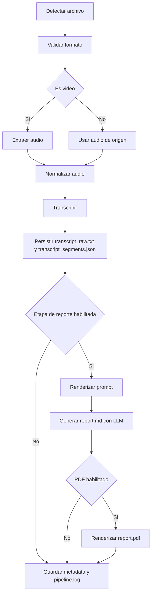

# Roadmap 4: Media Report CLI

Media Report CLI sigue siendo el proyecto más cercano a convertirse en un **producto técnico publicable** dentro de este portafolio. No necesita validación comercial compleja para empezar a generar valor; necesita estabilidad, pruebas reales, documentación, empaquetado y una versión instalable con un alcance honestamente definido.

Su valor principal sigue siendo claro, pero debe formularse con más precisión que antes:

> Una CLI en Python que toma audios o videos locales, ejecuta extracción, normalización y transcripción trazable, y deja artifacts organizados junto al archivo original. La siguiente gran brecha es cerrar la generación de reportes Markdown y PDF sin romper ese contrato base.

Este documento ya no actúa solo como wishlist. Debe servir como guía de seguimiento real, priorización y cierre de brechas para `v0.1.0` y para las fases siguientes.

---

# Resumen ejecutivo

| Área | Estado | Evidencia actual | Siguiente brecha |
| --- | --- | --- | --- |
| Pipeline principal | Parcial | `process` ya ejecuta `extract_audio`, `normalize_audio` y `transcribe` | Cerrar `report.md` y `report.pdf` |
| Arquitectura | Parcial | Capas hexagonales, ports, adapters y modelos Pydantic ya presentes | Hacer operativos los adapters LLM y PDF |
| Packaging | Cumplido | `pyproject.toml`, script `media-report`, extras y checklist manual existen | Automatizar instalación y smoke tests |
| Release | Parcial | Build y validación manual definidos | CI, TestPyPI/PyPI y Trusted Publishing |
| Portfolio | Pendiente | README y changelog básicos ya existen | Demo, caso de estudio, artículo y docs site |

---

# Estado actual

Media Report CLI ya tiene:

* arquitectura hexagonal definida y aplicada de forma razonable;
* CLI pública estable para `process`, `transcribe`, `doctor`, `config` y `templates`;
* artifact roots por archivo procesado;
* metadata persistida en `metadata.json`;
* trazabilidad operativa vía `pipeline.log`;
* reutilización con `--resume` y validación estricta de artifacts;
* extracción y normalización con FFmpeg ejecutadas de verdad;
* transcripción con `faster-whisper` detrás de un port estable;
* configuración por archivo y variables de entorno;
* empaquetado base para PyPI;
* pruebas unitarias e integraciones del contrato público actual.

Media Report CLI no tiene todavía:

* generación LLM end-to-end de `report.md`;
* render PDF end-to-end como etapa pública del pipeline;
* CI/CD de calidad y publicación;
* release pública validada en TestPyPI/PyPI;
* demo reproducible;
* documentación pública de extensibilidad para terceros.

Esto significa que el proyecto ya superó la fase de idea y de scaffold. El foco ya no es “crear una CLI”, sino **cerrar la brecha entre una CLI de transcripción trazable y una herramienta completa de reporting**.

---

# Objetivo estratégico de Media Report CLI

Construir una herramienta CLI instalable y reutilizable para transformar archivos multimedia en transcripciones y reportes estructurados, con una arquitectura flexible para usar diferentes motores de transcripción y diferentes proveedores LLM sin acoplar el dominio a adapters concretos.

En términos de posicionamiento profesional, este proyecto demuestra:

* automatización con Python;
* diseño de CLI pública estable;
* procesamiento multimedia local;
* integración futura con IA bajo ports explícitos;
* empaquetado profesional orientado a distribución;
* arquitectura extensible;
* producto open source publicable;
* capacidad de resolver una necesidad real con software reutilizable.

---

# Decisión técnica base

Media Report CLI debe mantenerse como **paquete Python publicable en PyPI**, no como aplicación pesada ni como SaaS.

La distribución debe seguir soportando:

* `uv tool install media-report-cli`
* `pipx install media-report-cli`
* `pip install media-report-cli`

La evolución del producto debe respetar estas decisiones:

* el comando raíz sigue siendo `media-report`;
* el `src/` layout se conserva;
* Linux y macOS son los targets oficiales;
* Windows sigue siendo experimental;
* las dependencias pesadas externas como `ffmpeg`, `pandoc`, `xelatex`, `lualatex` y `ollama` permanecen fuera de las runtime deps de Python;
* los recursos empaquetados se cargan mediante `importlib.resources`.

---

# Enfoque semanal

Media Report CLI sigue siendo un proyecto de fin de semana, pero con una regla más estricta:

| Bloque | Uso |
| --- | --- |
| Domingo mañana | Desarrollo, pruebas pesadas, integración real |
| Domingo tarde / buffer | Documentación, refactor, fixes, cierre |
| Viernes cierre | Elegir archivo de prueba, brecha concreta y criterio de salida |

Regla operativa:

> Cada fin de semana debe cerrar con una mejora ejecutable y verificable: comando, etapa cerrada, prueba real, fix con artifact, mejora de packaging o release interna.

---

# OKRs de Media Report CLI

## Objetivo 1: Estabilizar el flujo de procesamiento

**Estado general:** Parcial

**KR1. Procesar correctamente al menos 5 archivos reales de distinto tipo.**  
Pendiente. Ya existe soporte para fixtures locales y media real opcional, pero falta evidencia consolidada y auditable de cinco corridas end-to-end cerradas.

**KR2. Generar salida organizada por archivo procesado.**  
Cumplido. La CLI crea artifact roots por archivo con metadata, logs y outputs de transcripción separados.

**KR3. Separar claramente archivos temporales, transcripción, resumen y reporte final.**  
Parcial. Audio y transcripción ya están separados; resumen y reporte final aún no forman parte del pipeline ejecutado.

**KR4. Manejar errores comunes sin romper toda la ejecución.**  
Cumplido. Ya hay manejo de input inválido, conflictos de artifacts, metadata corrupta, FFmpeg ausente o fallido y errores de transcripción.

---

## Objetivo 2: Convertir la CLI en una herramienta instalable y usable

**Estado general:** Parcial alto

**KR1. Tener `pyproject.toml` completo y limpio.**  
Cumplido. El proyecto ya define metadata, extras, resources empaquetados, build backend y script público.

**KR2. Definir entry point global `media-report`.**  
Cumplido. El comando ya está declarado y documentado.

**KR3. Ejecutar instalación local con `pipx` o instalación editable.**  
Parcial. Está documentado y forma parte del checklist manual; falta evidencia automatizada y repetible.

**KR4. Publicar una primera versión en TestPyPI o preparar release candidata.**  
Pendiente. No hay evidencia de publicación ni de release candidate validada fuera del repositorio.

**KR5. Dejar lista la publicación segura en PyPI mediante flujo CI/CD.**  
Pendiente. Faltan workflows, Trusted Publishing y pipeline de publicación.

---

## Objetivo 3: Diseñar una arquitectura extensible

**Estado general:** Parcial

**KR1. Separar procesamiento multimedia, transcripción, limpieza, generación de reporte y proveedores LLM.**  
Parcial. Media processing y transcripción ya están bien separados; limpieza, report generation y PDF aún no están cerrados como workflow público.

**KR2. Permitir configurar proveedor LLM sin tocar el código.**  
Parcial. La configuración ya expone proveedor y modelo LLM, pero el adapter operativo sigue pendiente.

**KR3. Permitir cambiar motor de transcripción.**  
Parcial. El port `TranscriptionProvider` existe, pero el bootstrap actual sigue cableado a `faster-whisper`.

**KR4. Crear interfaces/ports para transcriptor, reporter y LLM client.**  
Cumplido. Los ports principales ya están presentes.

**KR5. Documentar cómo agregar un nuevo proveedor.**  
Pendiente. Falta una guía pública y explícita de extensibilidad.

---

## Objetivo 4: Publicar el proyecto como caso fuerte de portfolio

**Estado general:** Pendiente alto

**KR1. Crear README profesional.**  
Cumplido. El README actual ya cubre instalación, alcance, comandos y restricciones.

**KR2. Grabar o documentar una demo.**  
Pendiente. No existe una demo cerrada ni un walkthrough reproducible.

**KR3. Publicar una ficha del proyecto en el portfolio.**  
Pendiente. No hay asset de portfolio asociado al repo.

**KR4. Escribir un artículo técnico sobre el diseño de la CLI.**  
Pendiente. No existe artículo ni publicación equivalente.

**KR5. Tener una versión mínima etiquetada, por ejemplo `v0.1.0`.**  
Parcial. La versión está declarada en packaging, pero no hay evidencia aquí de tag o release pública.

**KR6. Crear documentación técnica en una página web.**  
Pendiente. Hoy la documentación vive en Markdown dentro del repo, no en un sitio técnico dedicado.

---

# Roadmap operativo de 90 días

Las fases originales siguen siendo válidas como forma de pensar el roadmap, pero deben leerse en función del estado real del proyecto.

## Fase 0 — Bootstrap packaging, docs, CLI skeleton y tests

**Estado:** Cumplida

### Objetivo

Crear la base distribuible del proyecto y fijar el contrato inicial del CLI.

### Entregables

* `pyproject.toml` base;
* script global `media-report`;
* templates empaquetados;
* README inicial;
* licencia;
* scaffold de tests;
* contrato de arquitectura.

### Resultado esperado

Un repositorio instalable, con forma de producto y no solo de experimento.

---

## Fase 1 — Pruebas pesadas y estabilización del flujo

**Estado:** Parcial
**Duración orientativa:** semanas 1 y 2

### Objetivo

Validar que la CLI funciona con archivos reales, no solo con ejemplos pequeños.

### Entregables

* carpeta de pruebas locales;
* dataset mínimo de audios y videos;
* registro de resultados;
* lista de errores encontrados;
* manejo inicial de excepciones;
* validación de formatos soportados;
* evidencia reproducible de al menos cinco corridas reales.

### Brecha actual

La base para trabajar con media real ya existe, pero falta consolidar la evidencia de pruebas pesadas como artifact del proyecto.

### Resultado esperado

Conocer con honestidad:

* qué funciona;
* qué se rompe;
* qué tarda demasiado;
* qué formato causa problemas;
* qué parte del output todavía necesita rediseño.

---

## Fase 2 — Estructura de salidas y archivos temporales

**Estado:** Mayormente cumplida
**Duración orientativa:** semanas 3 y 4

### Objetivo

Organizar el resultado de cada procesamiento de forma predecible y reutilizable.

### Entregables

* convención de carpetas por archivo;
* convención de nombres;
* metadata del proceso;
* log por ejecución;
* estrategia de reutilización con `--resume`;
* política explícita para outputs intermedios.

### Brecha actual

El repositorio ya crea artifact roots y conserva metadata y logs, pero aún no expone toda la separación final imaginada para `report/` y `pdf/` porque esas etapas siguen incompletas.

### Estructura objetivo de referencia

```txt
archivo-original.mp4
archivo-original_media_report/
├── metadata.json
├── pipeline.log
├── audio_extracted.wav
├── audio_normalized.wav
├── transcript_raw.txt
├── transcript_segments.json
├── prompt_used.md
├── llm_response_raw.txt
├── report.md
└── report.pdf
```

### Resultado esperado

La CLI deja resultados claros y trazables por archivo, sin archivos ambiguos sueltos ni pérdida de contexto.

---

## Fase 3 — Configuración y proveedores

**Estado:** Parcial alto
**Duración orientativa:** semanas 5 y 6

### Objetivo

Permitir que la CLI use configuración externa y deje lista la evolución hacia múltiples proveedores.

### Entregables

* archivo de configuración;
* variables de entorno;
* `config init`;
* `config show`;
* comando `doctor`;
* validación de configuración efectiva;
* selección explícita de proveedor y modelo a nivel de metadata.

### Brecha actual

La configuración bootstrap y `doctor` ya existen, pero la promesa de proveedores LLM intercambiables sin tocar código todavía no está cerrada porque falta el adapter operativo.

### Resultado esperado

La herramienta se siente configurable y trazable, no como un script rígido.

---

## Fase 4 — Arquitectura por servicios internos

**Estado:** Mayormente cumplida
**Duración orientativa:** semanas 7 y 8

### Objetivo

Separar responsabilidades internas para que el proyecto no se convierta en un script gigante.

### Entregables

* servicio de media extraction;
* servicio de transcription;
* preparación y ejecución separadas por caso de uso;
* ports e interfaces;
* adapters de filesystem y resources;
* tests unitarios por servicio;
* tests de integración del flujo actual.

### Brecha actual

La separación de media, artifacts y transcripción ya es real. La parte aún abierta es report generation y document rendering como etapas productivas de primer nivel.

### Resultado esperado

Una herramienta mantenible, no un conjunto de scripts pegados.

---

## Fase 5 — Prompt rendering y generación de reporte

**Estado:** Parcial
**Duración orientativa:** semanas 9 y 10

### Objetivo

Cerrar la brecha entre transcripción y reporte final.

### Entregables

* prompt rendering ya integrado al pipeline de reporte;
* adapter LLM operativo;
* persistencia de `prompt_used.md`;
* persistencia de `llm_response_raw.txt`;
* generación de `report.md`;
* manejo explícito de fallos de proveedor.

### Brecha actual

El render de prompt ya existe como capacidad interna. El adapter LLM y la generación final de `report.md` siguen pendientes.

### Resultado esperado

Poder transformar una transcripción válida en un reporte Markdown trazable.

---

## Fase 6 — Render PDF con Pandoc y LaTeX

**Estado:** Pendiente
**Duración orientativa:** semanas 11 y 12

### Objetivo

Agregar una salida documental final sin romper la trazabilidad del Markdown fuente.

### Entregables

* adapter de Pandoc operativo;
* resolución de template empaquetado;
* generación de `report.pdf`;
* preservación de `report.md` cuando el PDF falle;
* validaciones de entorno mejoradas.

### Brecha actual

Existe el builder de comando y las templates PDF, pero no la etapa pública cableada.

### Resultado esperado

Render PDF confiable, preservando siempre el artifact Markdown como fuente de verdad.

---

## Fase 7 — Empaquetado, distribución y validación de instalación

**Estado:** Parcial

### Objetivo

Preparar el proyecto para instalación profesional y publicación segura.

### Entregables

* `pyproject.toml` completo;
* entry point de CLI;
* README PyPI-friendly;
* build local;
* instalación local probada;
* `twine check`;
* smoke tests de instalación;
* publicación en TestPyPI o release candidata;
* workflow de GitHub Actions para test, build y release.

### Brecha actual

Packaging y checklist manual ya existen. CI/CD, publicación y smoke automation siguen pendientes.

### Resultado esperado

Media Report CLI debe poder instalarse y ejecutarse como herramienta real, no solo como checkout local.

---

## Fase 8 — Futuro de producto

**Estado:** Pendiente

### Objetivo

Extender el producto cuando la base esté cerrada y estable.

### Líneas futuras

* diarización;
* WhisperX;
* `clean`;
* `report` público si no se integra del todo en `process`;
* folder watchers;
* TUI;
* plugins;
* PDF QA;
* procesamiento por lotes más avanzado;
* integraciones externas.

### Resultado esperado

Evolución de producto sin sacrificar la confiabilidad del núcleo.

---

# Alcance real de `v0.1.0`

La versión `0.1.0` debe leerse como una **release bootstrap seria**, no como una release de flujo completo.

## Garantizado hoy

* procesar un archivo de audio hasta transcripción;
* procesar un archivo de video extrayendo audio;
* guardar outputs organizados por archivo;
* persistir metadata y logs;
* reutilizar artifacts válidos con `--resume`;
* ofrecer configuración básica y chequeos locales.

## No incluido todavía

* generación final de `report.md` con LLM operativo;
* generación de `report.pdf`;
* demo pública y assets de portfolio;
* publicación automatizada a TestPyPI o PyPI.

## Decisión pendiente para cerrar `v0.1.0`

Hay que decidir entre estas dos interpretaciones:

1. publicar `v0.1.0` como release de **transcripción trazable**, y dejar report generation para `v0.2.0`;
2. posponer `v0.1.0` hasta cerrar al menos `report.md`.

Mientras esa decisión no se cierre, la documentación no debe volver a prometer “flujo completo” como capacidad ya disponible.

---

# Roadmap macro de 12 meses

| Trimestre | Objetivo | Resultado esperado |
| --- | --- | --- |
| T1 | CLI estable y publicable | Flujo fuerte hasta transcripción, packaging sólido y decisión clara sobre `v0.1.0` |
| T2 | Report generation y extensibilidad | Proveedores múltiples, `report.md`, plantillas y mejoras de batch processing |
| T3 | Calidad profesional | CI/CD, documentación avanzada, smoke install, release segura |
| T4 | Producto maduro | PyPI estable, casos reales, demo fuerte, integración con portfolio |

---

# Backlog priorizado

## Alta prioridad

* cerrar evidencia de pruebas con archivos reales;
* mantener manejo robusto de errores;
* cerrar la estructura clara de salida;
* sostener configuración inicial y `doctor`;
* consolidar `process` como comando principal;
* mantener `transcribe` como etapa pública reutilizable;
* cerrar `report.md`;
* endurecer tests del pipeline;
* decidir el alcance final de `v0.1.0`;
* preparar release candidata interna.

## Prioridad media

* render PDF;
* múltiples plantillas de reporte;
* múltiples proveedores LLM;
* múltiples proveedores de transcripción;
* logs más ricos por etapa;
* publicación en TestPyPI;
* GitHub Actions;
* smoke automation;
* guía pública para agregar providers.

## Prioridad futura

* plugin system;
* interfaz TUI;
* reportes PDF más avanzados;
* exportación DOCX;
* integración con Notion;
* integración con Google Drive;
* resumen por capítulos;
* detección de hablantes;
* segmentación por temas;
* modo watch folder;
* procesamiento paralelo;
* GUI;
* sincronización cloud.

---

# Flujo principal recomendado



Lectura del flujo:

* lo implementado hoy llega con solidez hasta `Transcribir` y persistencia de artifacts;
* `Renderizar prompt` existe como capacidad interna parcial;
* `Generar report.md` y `Renderizar report.pdf` siguen siendo brechas del roadmap.

---

# Comandos mínimos del MVP

La definición original del MVP sigue siendo válida, pero debe distinguir entre **comandos públicos actuales** y **comandos objetivo**.

## Comandos públicos actuales

### `process`

Comando principal.

```bash
media-report process PATH [OPTIONS]
```

Estado: **Público y operativo**

Descripción:

* descubre media válida desde un archivo o carpeta;
* crea o reutiliza artifact roots;
* ejecuta `extract_audio`, `normalize_audio` y `transcribe`;
* planifica etapas futuras `report` y `pdf` en metadata.

Parámetros públicos actuales:

| Parámetro | Estado | Propósito |
| --- | --- | --- |
| `PATH` | Activo | Archivo o directorio a procesar |
| `--recursive` | Activo | Escanear subdirectorios |
| `--resume` | Activo | Reutilizar artifact directory válido |
| `--overwrite` | Compatibilidad | Alias deprecado de `--resume` |
| `--provider` | Activo de planning | Registrar proveedor LLM planeado y warning remoto |
| `--model` | Activo de planning | Registrar modelo LLM planeado |
| `--language` | Activo | Registrar idioma solicitado de transcripción |
| `--template` | Activo | Guardar template de prompt en metadata |
| `--output-format` | Activo de planning | Guardar formato preferido para etapas futuras |
| `--only-transcribe` | Activo | Limitar a extracción, normalización y transcripción |
| `--only-report` | Activo con prerequisitos | Requiere artifacts de transcripción reutilizables |

Ejemplos reales:

```bash
media-report process ./meeting.mp4
media-report process ./recordings --recursive
media-report process ./lecture.mp3 --resume
media-report process ./lecture.mp3 --language es --template meeting
media-report process ./lecture.mp3 --only-transcribe
media-report process ./lecture.mp3 --resume --only-report
```

### `transcribe`

Genera o regenera la transcripción desde un archivo media o un artifact directory reutilizable.

```bash
media-report transcribe PATH [OPTIONS]
```

Estado: **Público y operativo**

Parámetros públicos actuales:

| Parámetro | Estado | Propósito |
| --- | --- | --- |
| `PATH` | Activo | Archivo media o artifact directory |
| `--language` | Activo | Sobrescribir idioma solicitado |
| `--model` | Activo | Sobrescribir modelo de transcripción |
| `--overwrite` | Activo | Reejecutar solo la etapa `transcribe` si el audio reusable ya existe |

Ejemplos reales:

```bash
media-report transcribe ./audio.mp3
media-report transcribe ./audio.mp3 --language es
media-report transcribe ./lecture_media_report --overwrite
```

### `config init`

Crea configuración base.

```bash
media-report config init [OPTIONS]
```

Estado: **Público y operativo**

Parámetros actuales:

| Parámetro | Estado | Propósito |
| --- | --- | --- |
| `--force` | Activo | Sobrescribir config existente |
| `--path` | Activo | Ruta alternativa para escribir el config |

### `config show`

Muestra la configuración efectiva con secretos redactados.

```bash
media-report config show
```

Estado: **Público y operativo**

### `doctor`

Valida entorno bootstrap.

```bash
media-report doctor
```

Estado: **Público y operativo**

Debe revisar hoy:

* plataforma objetivo;
* `ffmpeg`;
* `pandoc`;
* `xelatex` y `lualatex`;
* `ollama`;
* disponibilidad de la capability de transcripción;
* templates empaquetados;
* estado del config file;
* presencia de API key redacted.

### `templates list`

Lista templates prompt y PDF empaquetados.

```bash
media-report templates list
```

Estado: **Público y operativo**

## Comandos objetivo todavía no públicos

### `report`

Estado: **No expuesto aún**

Comando deseable cuando exista report generation cerrada.

Responsabilidad objetivo:

* tomar artifacts de transcripción válidos;
* renderizar prompt;
* generar `report.md`;
* persistir respuesta bruta del proveedor.

### `clean`

Estado: **No expuesto aún**

Comando futuro para limpieza o normalización semántica de transcript, si se decide mantenerlo separado de `process`.

---

# Estructura de requerimientos MVP

| ID | Requerimiento | Prioridad | Estado actual |
| --- | --- | ---: | --- |
| MR-001 | La CLI debe procesar un archivo de audio | Alta | Cumplido |
| MR-002 | La CLI debe procesar un video extrayendo audio | Alta | Cumplido |
| MR-003 | La CLI debe generar transcripción en texto | Alta | Cumplido |
| MR-004 | La CLI debe generar reporte Markdown | Alta | Pendiente |
| MR-005 | La CLI debe crear una carpeta de salida por archivo | Alta | Cumplido |
| MR-006 | La CLI debe conservar logs de ejecución | Alta | Cumplido |
| MR-007 | La CLI debe permitir configuración básica | Alta | Cumplido |
| MR-008 | La CLI debe validar dependencias del entorno | Alta | Cumplido |
| MR-009 | La CLI debe manejar errores comunes | Alta | Cumplido |
| MR-010 | La CLI debe poder instalarse como comando global | Alta | Parcial |

---

# Definition of Done por feature

Una feature no se considera terminada hasta que cumpla:

```txt
- Tiene comando o función accesible.
- Tiene prueba mínima.
- Tiene manejo de error esperado.
- Tiene documentación breve.
- No rompe el flujo principal.
- Funciona con al menos un archivo real o fixture equivalente válido.
- Registra salida o log verificable.
```

Interpretación para este proyecto:

* si una capacidad existe solo como builder o scaffold, no cuenta como feature terminada;
* si una etapa persiste artifacts pero no actualiza metadata de forma consistente, no cuenta como cerrada;
* si una opción pública existe pero solo afecta planning y no ejecución, debe documentarse exactamente así;
* si la funcionalidad depende de media real opcional, debe existir al menos un plan reproducible de validación.

---

# Métricas de avance

| Métrica | Estado actual | Meta 90 días |
| --- | ---: | ---: |
| Archivos reales procesados con evidencia consolidada | Pendiente | 10 |
| Formatos probados | Parcial | 4 |
| Comandos públicos actuales | 6 | 6 |
| Etapas productivas cerradas | 3 | 5 |
| Tests del pipeline | Sí | Sí |
| README profesional | 1 | 1 |
| Release candidata | 0 | 1 |
| Versión `v0.1.0` publicada o etiquetada | Parcial | 1 |
| Caso de estudio en portfolio | 0 | 1 |
| Artículo técnico | 0 | 1 |

Las métricas que más importan hoy son:

* evidencia de media real procesada;
* cierre de `report.md`;
* build e instalación automatizados;
* claridad del alcance real de `v0.1.0`.

---

# Riesgos principales

| Riesgo | Impacto | Mitigación |
| --- | --- | --- |
| Archivos largos rompen el flujo | Alto | Pruebas pesadas desde el inicio y registro de tiempos |
| Dependencias multimedia difíciles | Alto | `doctor`, checklist de instalación y documentación clara |
| Salidas desordenadas o incompatibles con resume | Medio | Artifact root por archivo y validación estricta |
| Costos de LLM inesperados | Medio | Configuración explícita y warning para proveedor remoto |
| Transcripción de mala calidad | Medio | Permitir proveedores alternativos y trazabilidad de modelo/device |
| CLI demasiado compleja | Alto | Mantener `process` como comando principal |
| Publicar antes de estabilizar | Medio | Pasar primero por release candidate o TestPyPI |
| Documentación prometiendo más que el producto | Alto | Alinear README, roadmap y changelog en cada release |

---

# Qué NO hacer todavía

No conviene hacer ahora:

* interfaz gráfica;
* SaaS;
* dashboard web;
* integración con muchas APIs externas;
* PDF avanzado antes de cerrar `report.md`;
* detección compleja de hablantes;
* plugin system formal;
* paralelización avanzada;
* watch folder;
* sincronización cloud;
* automatización profunda con Notion o Drive.

Primero hace falta una CLI fuerte y confiable en su núcleo.

---

# Criterio para cerrar los primeros 90 días

Media Report CLI habrá avanzado correctamente si al cierre de este ciclo tienes:

1. CLI instalable localmente.
2. Flujo fuerte hasta transcripción con evidencia real.
3. Decisión cerrada sobre el alcance real de `v0.1.0`.
4. Estructura de salida clara y reusable.
5. Configuración básica.
6. Comando `doctor`.
7. README profesional y alineado con el producto.
8. Licencia MIT.
9. Release candidata interna o publicación controlada.
10. Plan cerrado para `report.md` o feature ya implementada.

Si además cierras `report.md`, el proyecto pasa de “base seria de transcripción” a “producto publicable de reporting”.

---

# Rol de Media Report CLI dentro de la consultoría

Media Report CLI puede cumplir tres funciones:

## 1. Herramienta personal

Convertir reuniones, clases, entrevistas y videos en artifacts útiles y trazables.

## 2. Producto open source

Mostrar capacidad técnica real en Python, CLI, multimedia, arquitectura y automatización.

## 3. Activo de consultoría

Servir como herramienta interna para levantar requerimientos desde reuniones, generar actas, detectar tareas y alimentar otros productos o procesos.

---

# Próximos pasos recomendados

1. Cerrar Fase 5 con un proveedor LLM operativo y persistencia real de `report.md`.
2. Cerrar Fase 6 con render PDF end-to-end y manejo de fallos que preserve Markdown y metadata.
3. Endurecer Fase 7 con CI, smoke install y flujo de publicación a TestPyPI/PyPI.
4. Preparar demo, guía de extensibilidad y assets de portfolio cuando el alcance real de `v0.1.0` quede decidido.

---

# Conclusión

Media Report CLI ya es una base sólida y publicable como herramienta de transcripción trazable. Todavía no es, en sentido estricto, la herramienta completa de “transcripción más reporte final” que describía la narrativa original. El roadmap actualizado debe conservar la riqueza de la visión, pero con una disciplina nueva: **no prometer como entregado lo que todavía sigue pendiente de cableado**.
